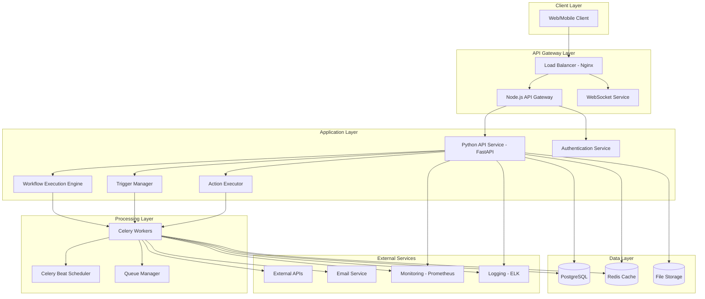

# FlowForge Backend Services Architecture

## 🏗️ Complete Backend Services Table

| **Service Name** | **Technology** | **Language** | **Primary Purpose** | **Responsibilities** | **Communication** | **Data Storage** | **Port** | **Scalability** | **Deployment** |
|------------------|----------------|--------------|---------------------|----------------------|-------------------|------------------|----------|-----------------|----------------|
| **Python API Service** | FastAPI | Python 3.8+ | Core API & Workflow Engine | Actions, Triggers, Workflow Execution, Context Management, API Routes | REST API, GraphQL | PostgreSQL | 8000 | Horizontal (Gunicorn) | Docker/K8s |
| **Node.js API Gateway** | Express.js | Node.js 16+ | API Gateway & Real-time | Authentication, Rate Limiting, Request Routing, WebSocket Management | HTTP/WS, REST | Redis (Sessions) | 3000 | Horizontal (PM2) | Docker/K8s |
| **Celery Workers** | Celery | Python 3.8+ | Background Task Processing | Workflow Execution, Long-running Tasks, Scheduled Jobs | Redis Broker | PostgreSQL | N/A | Horizontal (Multiple Workers) | Docker/K8s |
| **Redis Cache** | Redis | N/A | High-speed Caching & Messaging | Session Storage, Cache Layer, Message Broker, Task Queue | TCP | In-memory | 6379 | Cluster Mode | Docker/K8s |
| **PostgreSQL Database** | PostgreSQL | SQL | Primary Data Storage | Workflows, User Data, Execution Logs, Audit Trails | TCP | Persistent | 5432 | Read Replicas | Docker/K8s |
| **WebSocket Service** | Socket.io | Node.js | Real-time Communication | Live Workflow Updates, Real-time Notifications, Collaborative Editing | WebSocket | Redis (Pub/Sub) | 3001 | Horizontal | Docker/K8s |
| **Authentication Service** | JWT/OAuth | Node.js | User Authentication | Token Management, OAuth Integration, User Sessions | HTTP/REST | Redis | 3002 | Stateless | Docker/K8s |
| **File Storage Service** | MinIO/S3 | N/A | File & Media Storage | Workflow Assets, User Uploads, Temporary Files | HTTP/S3 API | Object Storage | 9000 | Distributed | Docker/K8s |
| **Monitoring Service** | Prometheus | N/A | System Monitoring | Metrics Collection, Health Checks, Performance Monitoring | HTTP | Time-series DB | 9090 | Single/Multiple | Docker/K8s |
| **Logging Service** | ELK Stack | N/A | Centralized Logging | Log Aggregation, Search, Analysis, Alerting | TCP/HTTP | Elasticsearch | 9200 | Cluster | Docker/K8s |
| **Load Balancer** | Nginx/HAProxy | N/A | Traffic Distribution | Request Routing, SSL Termination, Health Checks | HTTP/HTTPS | N/A | 80/443 | High Availability | Docker/K8s |
| **Background Scheduler** | Celery Beat | Python | Scheduled Tasks | Cron Jobs, Periodic Workflows, Maintenance Tasks | Redis | PostgreSQL | N/A | Single/Master | Docker/K8s |
| **Email Service** | SMTP/SendGrid | N/A | Email Notifications | Workflow Notifications, User Communications | SMTP/API | N/A | 587 | External Service | N/A |
| **External API Proxy** | Nginx | N/A | Third-party API Management | Rate Limiting, Caching, Error Handling | HTTP/HTTPS | Redis Cache | 8080 | Horizontal | Docker/K8s |
| **Workflow Execution Engine** | Custom Python | Python | Core Business Logic | Node Execution, Context Passing, Error Handling | Internal API | PostgreSQL | N/A | Horizontal | Docker/K8s |
| **Trigger Manager** | Custom Python | Python | Event Listening | Webhook Processing, File Watching, Schedule Monitoring | Various Protocols | PostgreSQL | N/A | Horizontal | Docker/K8s |
| **Action Executor** | Custom Python | Python | Task Execution | HTTP Requests, AI API Calls, Database Operations | Various APIs | PostgreSQL | N/A | Horizontal | Docker/K8s |
| **Queue Manager** | Redis/Celery | N/A | Task Distribution | Job Queuing, Priority Management, Dead Letter Queue | TCP | Redis | 6379 | Cluster | Docker/K8s |
| **Cache Manager** | Redis | N/A | Data Caching | API Response Caching, Session Storage, Temporary Data | TCP | In-memory | 6379 | Cluster | Docker/K8s |
| **Database Connection Pool** | SQLAlchemy | Python | Connection Management | Connection Pooling, Query Optimization, Transaction Management | TCP | PostgreSQL | 5432 | Connection Pool | Docker/K8s |
| **Health Check Service** | Custom | N/A | System Health Monitoring | Service Availability, Dependency Checks, Readiness Probes | HTTP | N/A | 8081 | N/A | Docker/K8s |
| **Metrics Exporter** | Prometheus Client | Python/Node.js | Metrics Collection | Performance Metrics, Business Metrics, Custom Metrics | HTTP | Prometheus | 8001 | N/A | Docker/K8s |
| **Configuration Service** | Environment Variables | N/A | Configuration Management | Environment-specific Settings, Secret Management, Feature Flags | File/Env | N/A | N/A | N/A | Docker/K8s |
| **Security Service** | Custom | Python/Node.js | Security Management | Input Validation, XSS Protection, CSRF Protection, Encryption | Internal | PostgreSQL | N/A | Horizontal | Docker/K8s |
| **Audit Service** | Custom | Python | Audit Logging | User Actions, System Events, Compliance Logging | Internal | PostgreSQL | N/A | Horizontal | Docker/K8s |

## 📊 Service Categories Breakdown

### 🔧 **Core Application Services**
| Service | Technology | Purpose |
|---------|------------|---------|
| Python API Service | FastAPI/Python | Main business logic and API endpoints |
| Node.js API Gateway | Express.js/Node.js | Request routing and real-time features |
| Workflow Execution Engine | Custom Python | Core workflow processing logic |
| Trigger Manager | Custom Python | Event-driven workflow triggers |
| Action Executor | Custom Python | Individual action/task execution |

### 🗄️ **Data & Storage Services**
| Service | Technology | Purpose |
|---------|------------|---------|
| PostgreSQL Database | PostgreSQL/SQL | Primary persistent storage |
| Redis Cache | Redis | High-speed caching and sessions |
| File Storage Service | MinIO/S3 | File and media storage |
| Cache Manager | Redis | Centralized caching layer |

### ⚙️ **Background Processing**
| Service | Technology | Purpose |
|---------|------------|---------|
| Celery Workers | Celery/Python | Asynchronous task processing |
| Background Scheduler | Celery Beat/Python | Scheduled and periodic tasks |
| Queue Manager | Redis/Celery | Task queuing and distribution |

### 🌐 **Communication & Integration**
| Service | Technology | Purpose |
|---------|------------|---------|
| WebSocket Service | Socket.io/Node.js | Real-time bidirectional communication |
| Authentication Service | JWT/OAuth/Node.js | User authentication and authorization |
| External API Proxy | Nginx | Third-party API management |
| Email Service | SMTP/SendGrid | Email notifications and communications |

### 📈 **Monitoring & Observability**
| Service | Technology | Purpose |
|---------|------------|---------|
| Monitoring Service | Prometheus | System and application metrics |
| Logging Service | ELK Stack | Centralized log aggregation |
| Health Check Service | Custom | Service health monitoring |
| Metrics Exporter | Prometheus Client | Custom metrics collection |

### 🔒 **Security & Compliance**
| Service | Technology | Purpose |
|---------|------------|---------|
| Security Service | Custom/Python/Node.js | Application security management |
| Audit Service | Custom/Python | Audit logging and compliance |
| Load Balancer | Nginx/HAProxy | Traffic distribution and SSL |

## 🔄 Service Communication Flow



## 🚀 Deployment Architecture Options

### **Option 1: Microservices (Recommended for Production)**
```
┌─────────────────┐ ┌─────────────────┐ ┌─────────────────┐
│   Python API    │ │   Node.js API   │ │   Celery        │
│     Service     │ │     Gateway     │ │   Workers       │
│                 │ │                 │ │                 │
│ • Port: 8000    │ │ • Port: 3000    │ │ • Redis: 6379   │
│ • Gunicorn      │ │ • PM2           │ │ • Python        │
└─────────────────┘ └─────────────────┘ └─────────────────┘
         │                       │               │
         └───────────────────────┼───────────────┘
                                 │
                    ┌─────────────────┐
                    │     Redis       │
                    │   (Broker)      │
                    │                 │
                    │ • Port: 6379    │
                    │ • Cluster Mode  │
                    └─────────────────┘
```

### **Option 2: Monolithic (Development/Small Scale)**
```
┌─────────────────────────────────────┐
│           FlowForge API             │
│                                     │
│ • Python FastAPI: Port 8000        │
│ • Node.js Gateway: Port 3000       │
│ • Celery Workers: Internal         │
│ • Redis: Port 6379                 │
│ • PostgreSQL: Port 5432            │
└─────────────────────────────────────┘
```

### **Option 3: Serverless (Cloud-Native)**
```
┌─────────────────┐ ┌─────────────────┐ ┌─────────────────┐
│   API Gateway   │ │   Lambda        │ │   Fargate       │
│   (AWS ALB)     │ │   Functions     │ │   Tasks         │
│                 │ │                 │ │                 │
│ • Load Balance  │ │ • Auto-scaling  │ │ • Celery        │
│ • SSL Term.     │ │ • Pay-per-use   │ │ • Workers       │
└─────────────────┘ └─────────────────┘ └─────────────────┘
```

## 📋 Service Dependencies Matrix

| **Service** | **Depends On** | **Required By** | **Critical Path** |
|-------------|----------------|------------------|-------------------|
| PostgreSQL | None | All Services | Yes |
| Redis | None | API, Workers, Cache | Yes |
| Python API | PostgreSQL, Redis | API Gateway, Clients | Yes |
| Node.js Gateway | Python API, Redis | Clients | Yes |
| Celery Workers | Redis, PostgreSQL | Workflow Engine | Yes |
| WebSocket Service | Redis, Node.js | Real-time Features | No |
| File Storage | None | Python API, Workers | No |
| Monitoring | All Services | DevOps Team | No |
| Load Balancer | All API Services | External Traffic | Yes |

## ⚡ Performance & Scalability Guidelines

### **Horizontal Scaling Candidates**
- ✅ **Python API Service**: Stateless, can scale horizontally
- ✅ **Node.js API Gateway**: Stateless, can scale horizontally
- ✅ **Celery Workers**: Can add more worker instances
- ✅ **Redis**: Supports clustering for horizontal scaling
- ✅ **PostgreSQL**: Supports read replicas

### **Vertical Scaling Candidates**
- ⚠️ **File Storage Service**: Depends on storage capacity
- ⚠️ **Monitoring Service**: Depends on metrics volume
- ⚠️ **Logging Service**: Depends on log volume

### **Resource Requirements (Per Service)**

| **Service** | **CPU** | **Memory** | **Storage** | **Network** |
|-------------|---------|------------|-------------|-------------|
| Python API | 1-2 vCPU | 1-2 GB | 10 GB | Moderate |
| Node.js Gateway | 0.5-1 vCPU | 512 MB | 5 GB | High |
| Celery Worker | 0.5-1 vCPU | 512 MB-1 GB | 5 GB | Moderate |
| Redis | 1-2 vCPU | 2-4 GB | 50 GB | High |
| PostgreSQL | 2-4 vCPU | 4-8 GB | 100 GB+ | Moderate |

## 🔧 Development vs Production Configuration

### **Development Environment**
```yaml
# docker-compose.yml (Development)
version: '3.8'
services:
  python-api:
    build: ./python-api
    ports:
      - "8000:8000"
    environment:
      - ENV=development
      - DEBUG=true

  nodejs-gateway:
    build: ./nodejs-gateway
    ports:
      - "3000:3000"
    environment:
      - NODE_ENV=development

  redis:
    image: redis:7-alpine
    ports:
      - "6379:6379"

  postgres:
    image: postgres:14
    ports:
      - "5432:5432"
```

### **Production Environment**
```yaml
# Kubernetes Deployment (Production)
apiVersion: apps/v1
kind: Deployment
metadata:
  name: python-api
spec:
  replicas: 3  # Horizontal scaling
  selector:
    matchLabels:
      app: python-api
  template:
    spec:
      containers:
      - name: python-api
        image: flowforge/python-api:latest
        resources:
          requests:
            memory: "1Gi"
            cpu: "500m"
          limits:
            memory: "2Gi"
            cpu: "1000m"
        ports:
        - containerPort: 8000
```

## 📊 Monitoring & Health Checks

### **Health Check Endpoints**
| **Service** | **Health Endpoint** | **Readiness** | **Liveness** |
|-------------|---------------------|---------------|--------------|
| Python API | `/health` | `/ready` | `/live` |
| Node.js Gateway | `/health` | `/ready` | `/live` |
| Redis | `PING` command | Connection check | Connection check |
| PostgreSQL | `SELECT 1` | Connection check | Connection check |
| Celery Workers | Flower `/api/workers` | Task queue check | Process check |

### **Key Metrics to Monitor**
- **API Response Time**: < 200ms average
- **Error Rate**: < 1% of requests
- **Database Connection Pool**: Utilization < 80%
- **Redis Memory Usage**: < 70% of available
- **Celery Queue Length**: < 1000 pending tasks
- **WebSocket Connections**: Monitor active connections

## 🎯 Summary

This comprehensive backend services table provides a complete overview of the FlowForge platform's architecture, covering:

- **25+ Services** across different categories
- **Communication patterns** and dependencies
- **Scalability options** for each service
- **Deployment configurations** for different environments
- **Resource requirements** and performance guidelines
- **Monitoring and health check** endpoints
- **Development vs production** configurations

The architecture follows **microservices principles** with clear separation of concerns, making it highly scalable, maintainable, and resilient for enterprise-grade automation workflows.
