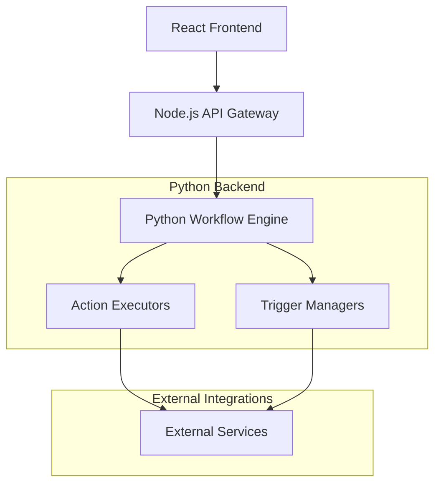

# FlowForge Python API Reference

## Overview

The FlowForge Python API is a comprehensive backend service for building enterprise-grade automation workflows. It provides a robust, scalable platform for executing complex business processes through a visual workflow designer interface.

### Key Features

- **🔄 Workflow Execution Engine**: DAG-based execution with parallel processing
- **🎯 20+ Built-in Actions**: HTTP, AI, Email, Data Processing, Storage, and more
- **🔔 6 Trigger Types**: Webhook, Schedule, File Watch, Notion, Telegram, Calendar
- **🔒 Enterprise Security**: Input validation, sandboxed execution, credential management
- **📊 Monitoring & Logging**: Comprehensive metrics, health checks, structured logging
- **⚡ High Performance**: Async operations, connection pooling, caching
- **🔧 Extensible Architecture**: Plugin system for custom actions and triggers

### Architecture Overview



## Authentication & Security

### API Key Authentication

All API requests require authentication using API keys:

```bash
curl -X POST "https://api.flowforge.com/v1/actions/execute" \
  -H "Authorization: Bearer YOUR_API_KEY" \
  -H "Content-Type: application/json" \
  -d '{"action_type": "http", "config": {...}}'
```

### Security Best Practices

1. **API Key Management**: Rotate keys regularly, use different keys for different environments
2. **Request Validation**: All inputs are validated and sanitized
3. **Rate Limiting**: Implemented at multiple levels to prevent abuse
4. **Audit Logging**: All API calls are logged for security monitoring
5. **Data Encryption**: Sensitive data is encrypted at rest and in transit

## Base URL

```
Production: https://api.flowforge.com
Staging: https://api-staging.flowforge.com
Development: http://localhost:8000
```

## API Versioning

The API uses semantic versioning with the following format:
- **Major version** (`v1`): Breaking changes
- **Minor version** (`v1.1`): New features, backward compatible
- **Patch version** (`v1.1.1`): Bug fixes, backward compatible

Current version: `v1.0.0`

## Rate Limiting

| Endpoint Type | Limit | Window |
|---------------|-------|--------|
| Action Execution | 1000 | per minute |
| Flow Execution | 500 | per minute |
| Trigger Operations | 200 | per minute |
| Read Operations | 5000 | per minute |

Rate limit headers are included in all responses:

```http
X-RateLimit-Limit: 1000
X-RateLimit-Remaining: 999
X-RateLimit-Reset: 1640995200
X-RateLimit-Retry-After: 60
```

## Error Handling

### HTTP Status Codes

| Code | Meaning | Description |
|------|---------|-------------|
| 200 | OK | Request successful |
| 201 | Created | Resource created successfully |
| 400 | Bad Request | Invalid request parameters |
| 401 | Unauthorized | Missing or invalid API key |
| 403 | Forbidden | Insufficient permissions |
| 404 | Not Found | Resource not found |
| 422 | Unprocessable Entity | Validation error |
| 429 | Too Many Requests | Rate limit exceeded |
| 500 | Internal Server Error | Server error |
| 502 | Bad Gateway | Gateway error |
| 503 | Service Unavailable | Service temporarily unavailable |

### Error Response Format

```json
{
  "error": {
    "code": "VALIDATION_ERROR",
    "message": "Invalid request parameters",
    "details": {
      "field": "action_type",
      "reason": "Required field is missing"
    }
  },
  "timestamp": "2024-01-15T10:30:00Z",
  "request_id": "req-123456789"
}
```

### Common Error Codes

| Error Code | HTTP Status | Description |
|------------|-------------|-------------|
| `VALIDATION_ERROR` | 422 | Request validation failed |
| `UNSUPPORTED_ACTION` | 400 | Action type not supported |
| `AUTHENTICATION_FAILED` | 401 | Invalid API key |
| `RATE_LIMIT_EXCEEDED` | 429 | Rate limit exceeded |
| `RESOURCE_NOT_FOUND` | 404 | Requested resource not found |
| `EXECUTION_FAILED` | 500 | Action/trigger execution failed |
| `CONFIGURATION_ERROR` | 400 | Invalid configuration |
| `SERVICE_UNAVAILABLE` | 503 | External service unavailable |

## Actions API

### Execute Action

Execute a single action with the specified configuration.

**Endpoint**: `POST /api/v1/actions/execute`

**Request Body**:
```json
{
  "action_type": "http",
  "config": {
    "method": "GET",
    "url": "https://api.example.com/users",
    "headers": {
      "Authorization": "Bearer token123",
      "Content-Type": "application/json"
    },
    "timeout": 30
  },
  "input_data": {
    "user_id": 123,
    "include_details": true
  }
}
```

**Response** (Success):
```json
{
  "success": true,
  "execution_id": "exec-abc123",
  "result": {
    "status_code": 200,
    "response": {
      "users": [
        {
          "id": 123,
          "name": "John Doe",
          "email": "john@example.com"
        }
      ]
    },
    "headers": {
      "content-type": "application/json",
      "x-request-id": "req-456"
    },
    "duration": 0.234
  },
  "timestamp": "2024-01-15T10:30:00Z"
}
```

**Response** (Error):
```json
{
  "success": false,
  "error": {
    "code": "EXECUTION_FAILED",
    "message": "HTTP request failed",
    "details": {
      "status_code": 500,
      "response": "Internal Server Error"
    }
  },
  "timestamp": "2024-01-15T10:30:00Z"
}
```

### Test Action Configuration

Test an action configuration without executing it.

**Endpoint**: `POST /api/v1/actions/test`

**Request Body**:
```json
{
  "action_type": "http",
  "config": {
    "method": "GET",
    "url": "https://api.example.com/test",
    "headers": {
      "Authorization": "Bearer token123"
    }
  }
}
```

**Response**:
```json
{
  "valid": true,
  "connection_test": true,
  "action_schema": {
    "type": "object",
    "properties": {
      "method": {
        "type": "string",
        "enum": ["GET", "POST", "PUT", "DELETE"],
        "default": "GET"
      },
      "url": {
        "type": "string",
        "format": "uri"
      },
      "headers": {
        "type": "object",
        "additionalProperties": {
          "type": "string"
        }
      },
      "timeout": {
        "type": "integer",
        "minimum": 1,
        "maximum": 300,
        "default": 30
      }
    },
    "required": ["method", "url"]
  },
  "error": null,
  "message": "HTTP action configuration is valid"
}
```

### Get Available Action Types

Retrieve all available action types and their categories.

**Endpoint**: `GET /api/v1/actions/types`

**Response**:
```json
{
  "action_types": {
    "http": {
      "name": "HTTP Request",
      "description": "Make HTTP requests to external APIs",
      "category": "web",
      "version": "1.0.0"
    },
    "openai": {
      "name": "OpenAI",
      "description": "Interact with OpenAI's GPT models",
      "category": "ai",
      "version": "1.0.0"
    },
    "send_email": {
      "name": "Send Email",
      "description": "Send emails via SMTP",
      "category": "communication",
      "version": "1.0.0"
    }
  },
  "categories": {
    "ai": ["openai", "claude", "gemini"],
    "communication": ["send_email", "parse_email", "telegram_chat"],
    "productivity": ["notion_database", "calendar_event"],
    "data_processing": ["data_transform", "data_filter", "data_aggregate"],
    "storage": ["google_drive", "s3_upload"],
    "web": ["http", "webhook_response"]
  }
}
```

### Get Action Schema

Get the configuration schema for a specific action type.

**Endpoint**: `GET /api/v1/actions/{action_type}/schema`

**Response**:
```json
{
  "action_type": "openai",
  "schema": {
    "type": "object",
    "properties": {
      "api_key": {
        "type": "string",
        "description": "OpenAI API key",
        "sensitive": true
      },
      "model": {
        "type": "string",
        "enum": ["gpt-4", "gpt-3.5-turbo", "gpt-4-turbo"],
        "default": "gpt-4"
      },
      "system_prompt": {
        "type": "string",
        "description": "System message to set AI behavior"
      },
      "max_tokens": {
        "type": "integer",
        "minimum": 1,
        "maximum": 4000,
        "default": 1000
      },
      "temperature": {
        "type": "number",
        "minimum": 0,
        "maximum": 2,
        "default": 0.7
      }
    },
    "required": ["api_key"]
  },
  "examples": [
    {
      "name": "Basic Chat Completion",
      "config": {
        "api_key": "sk-...",
        "model": "gpt-4",
        "system_prompt": "You are a helpful assistant.",
        "max_tokens": 500
      }
    }
  ]
}
```

## Flows API

### Execute Workflow

Execute a complete workflow with multiple connected nodes.

**Endpoint**: `POST /api/v1/flows/execute`

**Request Body**:
```json
{
  "flow_data": {
    "nodes": [
      {
        "id": "webhook-trigger",
        "type": "trigger",
        "trigger_type": "webhook",
        "config": {
          "webhook_id": "user-signup-webhook"
        }
      },
      {
        "id": "validate-user",
        "type": "action",
        "action_type": "http",
        "config": {
          "method": "POST",
          "url": "https://api.myservice.com/validate-user"
        },
        "dependencies": ["webhook-trigger"]
      },
      {
        "id": "send-welcome-email",
        "type": "action",
        "action_type": "send_email",
        "config": {
          "smtp_server": "smtp.gmail.com",
          "smtp_port": 587,
          "username": "noreply@mycompany.com",
          "password": "app-password"
        },
        "dependencies": ["validate-user"]
      }
    ],
    "connections": [
      {
        "from": "webhook-trigger",
        "to": "validate-user",
        "condition": null
      },
      {
        "from": "validate-user",
        "to": "send-welcome-email",
        "condition": "result.success == true"
      }
    ]
  },
  "input_variables": {
    "user_email": "john@example.com",
    "user_name": "John Doe"
  },
  "execution_options": {
    "timeout": 300,
    "max_parallel_nodes": 5,
    "fail_fast": true
  }
}
```

**Response** (Success):
```json
{
  "success": true,
  "flow_id": "flow-user-signup-123",
  "execution_id": "exec-456",
  "status": "completed",
  "executed_nodes": [
    {
      "node_id": "webhook-trigger",
      "status": "completed",
      "result": {
        "webhook_data": {
          "user_id": 123,
          "email": "john@example.com"
        }
      },
      "execution_time": 0.001,
      "started_at": "2024-01-15T10:30:00Z",
      "completed_at": "2024-01-15T10:30:00Z"
    },
    {
      "node_id": "validate-user",
      "status": "completed",
      "result": {
        "success": true,
        "user_valid": true
      },
      "execution_time": 0.234,
      "started_at": "2024-01-15T10:30:00Z",
      "completed_at": "2024-01-15T10:30:00Z"
    },
    {
      "node_id": "send-welcome-email",
      "status": "completed",
      "result": {
        "success": true,
        "message_id": "msg-789"
      },
      "execution_time": 0.156,
      "started_at": "2024-01-15T10:30:00Z",
      "completed_at": "2024-01-15T10:30:00Z"
    }
  ],
  "duration": 0.391,
  "started_at": "2024-01-15T10:30:00Z",
  "completed_at": "2024-01-15T10:30:00Z"
}
```

### Get Execution Status

Get the status of a workflow execution.

**Endpoint**: `GET /api/v1/flows/execution/{execution_id}`

**Response**:
```json
{
  "execution_id": "exec-456",
  "flow_id": "flow-user-signup-123",
  "status": "running",
  "progress": {
    "completed_nodes": 2,
    "total_nodes": 3,
    "percentage": 66.67
  },
  "current_node": "send-welcome-email",
  "executed_nodes": [
    {
      "node_id": "webhook-trigger",
      "status": "completed",
      "result": {"webhook_data": {...}},
      "execution_time": 0.001
    },
    {
      "node_id": "validate-user",
      "status": "completed",
      "result": {"success": true},
      "execution_time": 0.234
    }
  ],
  "pending_nodes": ["send-welcome-email"],
  "failed_nodes": [],
  "duration": 0.391,
  "started_at": "2024-01-15T10:30:00Z",
  "estimated_completion": "2024-01-15T10:30:05Z"
}
```

### Get Execution History

Get the execution history for workflows.

**Endpoint**: `GET /api/v1/flows/executions`

**Query Parameters**:
- `flow_id` (optional): Filter by specific flow
- `status` (optional): Filter by execution status (`running`, `completed`, `error`)
- `limit` (optional): Maximum number of results (default: 50, max: 1000)
- `offset` (optional): Pagination offset (default: 0)
- `start_date` (optional): Filter executions after this date (ISO 8601)
- `end_date` (optional): Filter executions before this date (ISO 8601)

**Response**:
```json
{
  "executions": [
    {
      "execution_id": "exec-456",
      "flow_id": "flow-user-signup-123",
      "status": "completed",
      "duration": 0.391,
      "started_at": "2024-01-15T10:30:00Z",
      "completed_at": "2024-01-15T10:30:00Z",
      "trigger_type": "webhook",
      "error_message": null
    },
    {
      "execution_id": "exec-455",
      "flow_id": "flow-data-sync-456",
      "status": "error",
      "duration": 2.134,
      "started_at": "2024-01-15T10:25:00Z",
      "completed_at": "2024-01-15T10:27:02Z",
      "trigger_type": "schedule",
      "error_message": "Database connection failed"
    }
  ],
  "total_count": 2,
  "pagination": {
    "limit": 50,
    "offset": 0,
    "has_more": false
  }
}
```

### Validate Workflow

Validate a workflow definition without executing it.

**Endpoint**: `POST /api/v1/flows/validate`

**Request Body**:
```json
{
  "nodes": [
    {
      "id": "http-action",
      "type": "action",
      "action_type": "http",
      "config": {
        "method": "GET",
        "url": "https://api.example.com/data"
      }
    }
  ],
  "connections": []
}
```

**Response** (Valid):
```json
{
  "valid": true,
  "errors": [],
  "warnings": [
    "Consider adding error handling for HTTP action"
  ],
  "metadata": {
    "node_count": 1,
    "connection_count": 0,
    "estimated_complexity": "low"
  }
}
```

**Response** (Invalid):
```json
{
  "valid": false,
  "errors": [
    {
      "type": "VALIDATION_ERROR",
      "node_id": "http-action",
      "field": "config.url",
      "message": "URL is required for HTTP action"
    },
    {
      "type": "VALIDATION_ERROR",
      "message": "Node 'missing-node' referenced in connections but not found"
    }
  ],
  "warnings": [],
  "metadata": {
    "node_count": 1,
    "connection_count": 1,
    "estimated_complexity": "low"
  }
}
```

## Triggers API

### Create Trigger

Create and activate a new trigger.

**Endpoint**: `POST /api/v1/triggers/create`

**Request Body**:
```json
{
  "trigger_type": "webhook",
  "config": {
    "webhook_id": "user-registration-webhook",
    "secret": "webhook-secret-key",
    "validate_signature": true,
    "allowed_ips": ["192.168.1.100", "10.0.0.1/24"]
  },
  "flow_id": "flow-user-welcome-123",
  "description": "Trigger for new user registrations"
}
```

**Response**:
```json
{
  "success": true,
  "trigger_id": "trig-789",
  "trigger_type": "webhook",
  "webhook_url": "https://api.flowforge.com/webhooks/user-registration-webhook",
  "status": "active",
  "created_at": "2024-01-15T10:30:00Z",
  "config_summary": {
    "webhook_id": "user-registration-webhook",
    "validate_signature": true,
    "ip_filtering_enabled": true
  }
}
```

### Test Trigger

Test a trigger configuration without creating it.

**Endpoint**: `POST /api/v1/triggers/test/{trigger_type}`

**Request Body**:
```json
{
  "config": {
    "webhook_id": "test-webhook",
    "secret": "test-secret"
  }
}
```

**Response**:
```json
{
  "success": true,
  "trigger_type": "webhook",
  "test_results": {
    "configuration_valid": true,
    "connection_test": true,
    "permissions_check": true
  },
  "message": "Webhook trigger test successful",
  "webhook_url": "https://api.flowforge.com/webhooks/test-webhook",
  "warnings": [
    "Consider enabling IP filtering for production use"
  ]
}
```

### Get Available Trigger Types

Retrieve all available trigger types and their categories.

**Endpoint**: `GET /api/v1/triggers/types`

**Response**:
```json
{
  "trigger_types": {
    "webhook": {
      "name": "Webhook",
      "description": "HTTP webhook trigger",
      "category": "web",
      "version": "1.0.0"
    },
    "schedule": {
      "name": "Schedule",
      "description": "Time-based trigger using cron expressions",
      "category": "time",
      "version": "1.0.0"
    },
    "file_watch": {
      "name": "File Watch",
      "description": "Monitor file system changes",
      "category": "filesystem",
      "version": "1.0.0"
    }
  },
  "categories": {
    "web": ["webhook"],
    "time": ["schedule"],
    "filesystem": ["file_watch"],
    "productivity": ["notion_database", "calendar_event"],
    "communication": ["telegram_message"]
  }
}
```

### Get Webhook Status

Get the status and statistics of a webhook trigger.

**Endpoint**: `GET /api/v1/triggers/webhook/{webhook_id}/status`

**Response**:
```json
{
  "webhook_id": "user-registration-webhook",
  "is_active": true,
  "created_at": "2024-01-15T10:30:00Z",
  "last_triggered": "2024-01-15T14:22:15Z",
  "total_requests": 1247,
  "successful_requests": 1245,
  "failed_requests": 2,
  "recent_requests": [
    {
      "timestamp": "2024-01-15T14:22:15Z",
      "status": "success",
      "execution_id": "exec-789",
      "ip_address": "192.168.1.100",
      "user_agent": "MyApp-Webhook/1.0"
    },
    {
      "timestamp": "2024-01-15T14:15:30Z",
      "status": "failed",
      "error": "Invalid signature",
      "ip_address": "10.0.0.5"
    }
  ],
  "average_response_time": 0.045,
  "uptime_percentage": 99.8
}
```

## Health Check API

### System Health

Get the overall health status of the system.

**Endpoint**: `GET /health`

**Response**:
```json
{
  "status": "healthy",
  "timestamp": "2024-01-15T10:30:00Z",
  "version": "1.0.0",
  "services": {
    "database": "healthy",
    "redis": "healthy",
    "external_apis": "healthy"
  },
  "metrics": {
    "uptime_seconds": 86400,
    "total_requests": 15420,
    "active_connections": 12,
    "memory_usage_mb": 256
  }
}
```

### Detailed Health Check

Get detailed health information for all services.

**Endpoint**: `GET /health/detailed`

**Response**:
```json
{
  "status": "healthy",
  "timestamp": "2024-01-15T10:30:00Z",
  "checks": {
    "database": {
      "status": "healthy",
      "response_time_ms": 12,
      "connection_pool_size": 10,
      "active_connections": 3
    },
    "redis": {
      "status": "healthy",
      "response_time_ms": 5,
      "memory_usage_mb": 45,
      "connected_clients": 12
    },
    "external_services": {
      "openai_api": {
        "status": "healthy",
        "response_time_ms": 234,
        "last_successful_call": "2024-01-15T10:29:45Z"
      },
      "smtp_server": {
        "status": "healthy",
        "response_time_ms": 89,
        "last_successful_send": "2024-01-15T10:28:12Z"
      }
    }
  },
  "system_info": {
    "cpu_usage_percent": 23.5,
    "memory_usage_percent": 45.2,
    "disk_usage_percent": 67.8,
    "load_average": [1.2, 1.1, 1.0]
  }
}
```

## SDK Examples

### Python SDK

```python
from flowforge import FlowForgeClient

# Initialize client
client = FlowForgeClient(api_key="your-api-key")

# Execute an action
result = client.actions.execute(
    action_type="http",
    config={
        "method": "GET",
        "url": "https://api.example.com/users"
    }
)

# Execute a workflow
workflow_result = client.flows.execute(
    flow_data={
        "nodes": [...],
        "connections": [...]
    },
    input_variables={"user_id": 123}
)

# Create a trigger
trigger = client.triggers.create(
    trigger_type="webhook",
    config={"webhook_id": "my-webhook"},
    flow_id="flow-123"
)
```

### JavaScript/Node.js SDK

```javascript
const { FlowForgeClient } = require('flowforge-sdk');

const client = new FlowForgeClient({
  apiKey: 'your-api-key',
  baseURL: 'https://api.flowforge.com'
});

// Execute action
const result = await client.actions.execute({
  actionType: 'openai',
  config: {
    apiKey: process.env.OPENAI_API_KEY,
    model: 'gpt-4',
    systemPrompt: 'You are a helpful assistant'
  },
  inputData: {
    prompt: 'Explain quantum computing'
  }
});

// Monitor execution
const status = await client.flows.getExecutionStatus(result.executionId);
```

### cURL Examples

```bash
# Execute HTTP action
curl -X POST "https://api.flowforge.com/api/v1/actions/execute" \
  -H "Authorization: Bearer YOUR_API_KEY" \
  -H "Content-Type: application/json" \
  -d '{
    "action_type": "http",
    "config": {
      "method": "GET",
      "url": "https://api.example.com/users"
    }
  }'

# Create webhook trigger
curl -X POST "https://api.flowforge.com/api/v1/triggers/create" \
  -H "Authorization: Bearer YOUR_API_KEY" \
  -H "Content-Type: application/json" \
  -d '{
    "trigger_type": "webhook",
    "config": {
      "webhook_id": "user-signup",
      "secret": "my-webhook-secret"
    },
    "flow_id": "flow-123"
  }'

# Get execution status
curl -X GET "https://api.flowforge.com/api/v1/flows/execution/exec-123" \
  -H "Authorization: Bearer YOUR_API_KEY"
```

## Best Practices

### Performance Optimization

1. **Batch Operations**: Use bulk operations when possible
2. **Connection Pooling**: Reuse connections for external services
3. **Caching**: Cache frequently accessed data
4. **Async Processing**: Use async operations for I/O bound tasks
5. **Resource Limits**: Set appropriate timeouts and limits

### Error Handling

1. **Graceful Degradation**: Handle service failures gracefully
2. **Retry Logic**: Implement exponential backoff for retries
3. **Circuit Breakers**: Prevent cascade failures
4. **Monitoring**: Monitor error rates and patterns
5. **Fallbacks**: Provide fallback mechanisms for critical services

### Security

1. **Input Validation**: Always validate and sanitize inputs
2. **API Key Rotation**: Rotate keys regularly
3. **Audit Logging**: Log all sensitive operations
4. **Rate Limiting**: Implement appropriate rate limits
5. **Data Encryption**: Encrypt sensitive data

### Monitoring

1. **Health Checks**: Implement comprehensive health checks
2. **Metrics Collection**: Collect relevant metrics
3. **Alerting**: Set up alerts for critical issues
4. **Logging**: Use structured logging
5. **Tracing**: Implement distributed tracing

## Webhooks

### Webhook Payload Format

```json
{
  "webhook_id": "user-signup",
  "event_type": "user.created",
  "timestamp": "2024-01-15T10:30:00Z",
  "signature": "sha256=abc123...",
  "data": {
    "user_id": 123,
    "email": "john@example.com",
    "name": "John Doe",
    "created_at": "2024-01-15T10:30:00Z"
  },
  "metadata": {
    "source_ip": "192.168.1.100",
    "user_agent": "MyApp/1.0",
    "request_id": "req-456"
  }
}
```

### Webhook Signature Verification

```python
import hmac
import hashlib

def verify_webhook_signature(payload, signature, secret):
    expected_signature = hmac.new(
        secret.encode(),
        payload.encode(),
        hashlib.sha256
    ).hexdigest()

    return hmac.compare_digest(f"sha256={expected_signature}", signature)
```

### Webhook Error Responses

```json
{
  "error": {
    "code": "INVALID_SIGNATURE",
    "message": "Webhook signature verification failed"
  },
  "timestamp": "2024-01-15T10:30:00Z"
}
```

## Data Models

### Action Types

| Action Type | Category | Description |
|-------------|----------|-------------|
| `http` | Web | Make HTTP requests |
| `openai` | AI | OpenAI GPT integration |
| `claude` | AI | Anthropic Claude integration |
| `gemini` | AI | Google Gemini integration |
| `send_email` | Communication | Send emails via SMTP |
| `parse_email` | Communication | Parse email content |
| `telegram_chat` | Communication | Telegram bot integration |
| `notion_database` | Productivity | Notion database operations |
| `notion_page` | Productivity | Notion page operations |
| `calendar_event` | Productivity | Calendar event management |
| `data_transform` | Data Processing | Transform data structures |
| `data_filter` | Data Processing | Filter data collections |
| `data_aggregate` | Data Processing | Aggregate data |
| `google_drive` | Storage | Google Drive integration |
| `s3_upload` | Storage | AWS S3 upload |
| `structured_output` | AI Agent | Generate structured AI outputs |
| `memory` | AI Agent | AI agent memory management |

### Trigger Types

| Trigger Type | Category | Description |
|-------------|----------|-------------|
| `webhook` | Web | HTTP webhook trigger |
| `schedule` | Time | Cron-based scheduling |
| `file_watch` | Filesystem | File system monitoring |
| `notion_database` | Productivity | Notion database changes |
| `telegram_message` | Communication | Telegram message trigger |
| `calendar_event` | Productivity | Calendar event triggers |

### Execution Statuses

| Status | Description |
|--------|-------------|
| `pending` | Execution queued |
| `running` | Execution in progress |
| `completed` | Execution finished successfully |
| `error` | Execution failed |
| `cancelled` | Execution was cancelled |
| `timeout` | Execution timed out |

## Changelog

### Version 1.0.0 (Current)

**Features:**
- Complete workflow execution engine
- 20+ built-in actions
- 6 trigger types
- RESTful API
- Comprehensive error handling
- Health monitoring
- Rate limiting

**Breaking Changes:**
- Initial release - no breaking changes

### Version 0.9.0 (Beta)

**Features:**
- Basic workflow execution
- HTTP and OpenAI actions
- Webhook triggers
- Basic API endpoints

---

For more information, see the [Getting Started Guide](./guides/getting-started.md) or visit our [GitHub repository](https://github.com/flowforge/python-api).
