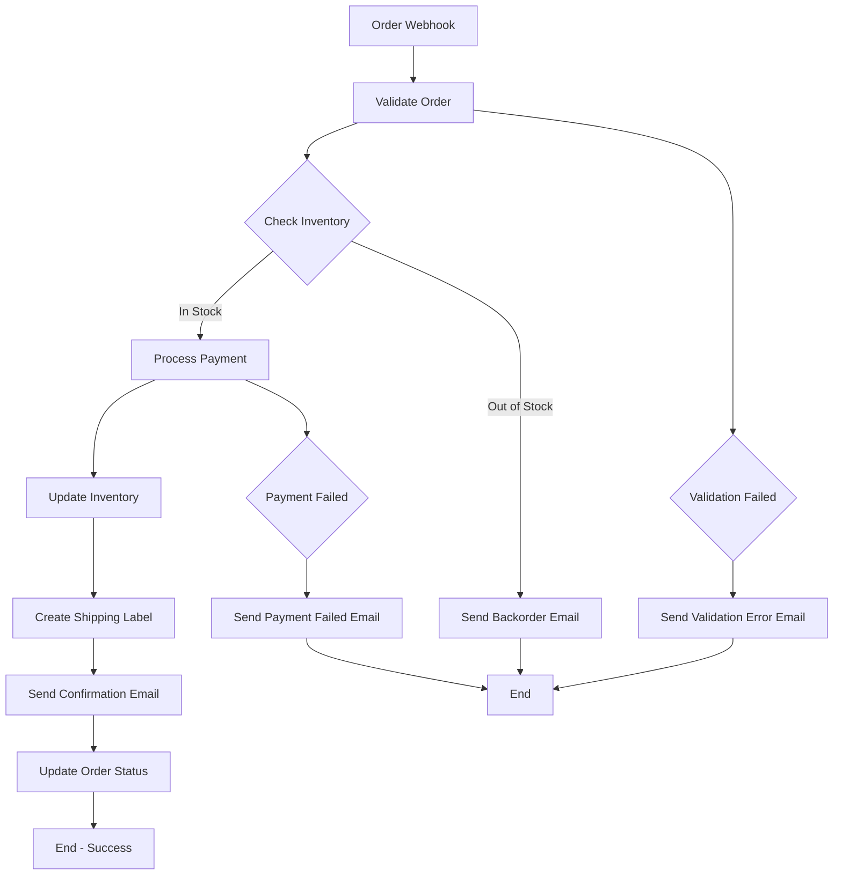

# E-commerce Order Fulfillment Workflow

A comprehensive order processing workflow that demonstrates real-world e-commerce automation with inventory management, payment processing, shipping coordination, and customer notifications.

## Business Use Case

When a customer places an order on an e-commerce platform, this workflow:

1. **Validates the order** and customer information
2. **Checks inventory** availability for all items
3. **Processes payment** through the payment gateway
4. **Updates inventory** levels in the system
5. **Creates shipping labels** and coordinates delivery
6. **Sends confirmation emails** to customer and warehouse
7. **Updates order status** in the e-commerce platform
8. **Handles errors gracefully** with appropriate notifications

## Workflow Architecture



## Implementation

### Complete Workflow Definition

**`workflow.json`**:
```json
{
  "name": "E-commerce Order Fulfillment",
  "description": "Complete order processing workflow with inventory, payment, and shipping",
  "version": "2.0.0",
  "nodes": [
    {
      "id": "order-webhook",
      "type": "trigger",
      "trigger_type": "webhook",
      "name": "Order Webhook Trigger",
      "description": "Receives new order webhooks from e-commerce platform",
      "config": {
        "webhook_id": "order-fulfillment-webhook",
        "secret": "${WEBHOOK_SECRET}",
        "validate_signature": true,
        "allowed_ips": ["192.168.1.0/24", "10.0.0.0/8"]
      }
    },
    {
      "id": "validate-order",
      "type": "action",
      "action_type": "data_filter",
      "name": "Validate Order Data",
      "description": "Validates order data structure and required fields",
      "config": {
        "filter_condition": "input_data.order_id && input_data.customer_email && input_data.items && input_data.items.length > 0",
        "error_message": "Invalid order data: missing required fields"
      },
      "dependencies": ["order-webhook"]
    },
    {
      "id": "check-inventory",
      "type": "action",
      "action_type": "http",
      "name": "Check Inventory",
      "description": "Check inventory availability for all order items",
      "config": {
        "method": "POST",
        "url": "${INVENTORY_API_URL}/inventory/check",
        "headers": {
          "Authorization": "Bearer ${INVENTORY_API_KEY}",
          "Content-Type": "application/json",
          "X-API-Version": "v2"
        },
        "body": {
          "order_id": "${input_data.order_id}",
          "items": "${input_data.items}",
          "check_availability": true,
          "reserve_items": true
        },
        "timeout": 30,
        "retry_count": 3,
        "retry_delay": 2
      },
      "dependencies": ["validate-order"]
    },
    {
      "id": "process-payment",
      "type": "action",
      "action_type": "http",
      "name": "Process Payment",
      "description": "Process payment through payment gateway",
      "config": {
        "method": "POST",
        "url": "${PAYMENT_API_URL}/payments/charge",
        "headers": {
          "Authorization": "Bearer ${PAYMENT_API_KEY}",
          "Content-Type": "application/json",
          "Idempotency-Key": "${input_data.order_id}"
        },
        "body": {
          "amount": "${input_data.total_amount}",
          "currency": "${input_data.currency || 'USD'}",
          "customer_id": "${input_data.customer_id}",
          "order_id": "${input_data.order_id}",
          "payment_method": "${input_data.payment_method}",
          "billing_address": "${input_data.billing_address}",
          "metadata": {
            "order_source": "ecommerce",
            "items_count": "${input_data.items.length}"
          }
        },
        "timeout": 45,
        "retry_count": 2,
        "retry_delay": 5
      },
      "dependencies": ["check-inventory"]
    },
    {
      "id": "update-inventory",
      "type": "action",
      "action_type": "http",
      "name": "Update Inventory",
      "description": "Update inventory levels after successful payment",
      "config": {
        "method": "POST",
        "url": "${INVENTORY_API_URL}/inventory/update",
        "headers": {
          "Authorization": "Bearer ${INVENTORY_API_KEY}",
          "Content-Type": "application/json"
        },
        "body": {
          "order_id": "${input_data.order_id}",
          "items": "${input_data.items}",
          "operation": "fulfill",
          "reference_id": "${previous_outputs.process-payment.result.transaction_id}"
        },
        "timeout": 30
      },
      "dependencies": ["process-payment"]
    },
    {
      "id": "create-shipping",
      "type": "action",
      "action_type": "http",
      "name": "Create Shipping Label",
      "description": "Create shipping labels and coordinate delivery",
      "config": {
        "method": "POST",
        "url": "${SHIPPING_API_URL}/shipments/create",
        "headers": {
          "Authorization": "Bearer ${SHIPPING_API_KEY}",
          "Content-Type": "application/json"
        },
        "body": {
          "order_id": "${input_data.order_id}",
          "customer_address": "${input_data.shipping_address}",
          "items": "${input_data.items}",
          "weight": "${input_data.total_weight || 1.0}",
          "dimensions": "${input_data.package_dimensions}",
          "shipping_method": "${input_data.shipping_method || 'standard'}",
          "insurance_required": "${input_data.insurance_required || false}",
          "signature_required": "${input_data.signature_required || false}"
        },
        "timeout": 60,
        "retry_count": 2
      },
      "dependencies": ["update-inventory"]
    },
    {
      "id": "send-confirmation",
      "type": "action",
      "action_type": "send_email",
      "name": "Send Order Confirmation",
      "description": "Send order confirmation email to customer",
      "config": {
        "smtp_server": "${SMTP_SERVER}",
        "smtp_port": "${SMTP_PORT}",
        "username": "${SMTP_USERNAME}",
        "password": "${SMTP_PASSWORD}",
        "use_tls": true,
        "from_email": "orders@yourstore.com",
        "from_name": "Your Store Orders",
        "to_email": "${input_data.customer_email}",
        "subject": "Order Confirmation - #${input_data.order_id}",
        "template": "order-confirmation",
        "template_vars": {
          "customer_name": "${input_data.customer_name}",
          "order_id": "${input_data.order_id}",
          "order_date": "${timestamp}",
          "items": "${input_data.items}",
          "total_amount": "${input_data.total_amount}",
          "shipping_address": "${input_data.shipping_address}",
          "tracking_number": "${previous_outputs.create-shipping.result.tracking_number}",
          "estimated_delivery": "${previous_outputs.create-shipping.result.estimated_delivery}"
        }
      },
      "dependencies": ["create-shipping"]
    },
    {
      "id": "update-order-status",
      "type": "action",
      "action_type": "http",
      "name": "Update Order Status",
      "description": "Update order status in e-commerce platform",
      "config": {
        "method": "PUT",
        "url": "${ECOMMERCE_API_URL}/orders/${input_data.order_id}/status",
        "headers": {
          "Authorization": "Bearer ${ECOMMERCE_API_KEY}",
          "Content-Type": "application/json"
        },
        "body": {
          "status": "fulfilled",
          "tracking_number": "${previous_outputs.create-shipping.result.tracking_number}",
          "carrier": "${previous_outputs.create-shipping.result.carrier}",
          "fulfillment_date": "${timestamp}",
          "metadata": {
            "payment_transaction_id": "${previous_outputs.process-payment.result.transaction_id}",
            "shipping_label_id": "${previous_outputs.create-shipping.result.label_id}"
          }
        },
        "timeout": 30
      },
      "dependencies": ["send-confirmation"]
    },
    {
      "id": "send-warehouse-notification",
      "type": "action",
      "action_type": "send_email",
      "name": "Notify Warehouse",
      "description": "Send fulfillment notification to warehouse team",
      "config": {
        "smtp_server": "${SMTP_SERVER}",
        "smtp_port": "${SMTP_PORT}",
        "username": "${SMTP_USERNAME}",
        "password": "${SMTP_PASSWORD}",
        "use_tls": true,
        "from_email": "system@yourstore.com",
        "from_name": "Order System",
        "to_email": "warehouse@yourstore.com",
        "subject": "Order Fulfillment Required - #${input_data.order_id}",
        "body": "Order ${input_data.order_id} has been paid and needs fulfillment.\\n\\nItems: ${JSON.stringify(input_data.items)}\\n\\nShipping Address: ${JSON.stringify(input_data.shipping_address)}\\n\\nTracking: ${previous_outputs.create-shipping.result.tracking_number}"
      },
      "dependencies": ["update-order-status"]
    },
    {
      "id": "validation-error-handler",
      "type": "action",
      "action_type": "send_email",
      "name": "Handle Validation Errors",
      "description": "Send notification for validation failures",
      "config": {
        "smtp_server": "${SMTP_SERVER}",
        "smtp_port": "${SMTP_PORT}",
        "username": "${SMTP_USERNAME}",
        "password": "${SMTP_PASSWORD}",
        "use_tls": true,
        "from_email": "system@yourstore.com",
        "from_name": "Order System",
        "to_email": "support@yourstore.com",
        "subject": "Order Validation Failed - #${input_data.order_id || 'unknown'}",
        "body": "Order validation failed: ${error.message}\\n\\nOrder Data: ${JSON.stringify(input_data)}\\n\\nTimestamp: ${timestamp}"
      }
    },
    {
      "id": "payment-error-handler",
      "type": "action",
      "action_type": "send_email",
      "name": "Handle Payment Errors",
      "description": "Send notification for payment failures",
      "config": {
        "smtp_server": "${SMTP_SERVER}",
        "smtp_port": "${SMTP_PORT}",
        "username": "${SMTP_USERNAME}",
        "password": "${SMTP_PASSWORD}",
        "use_tls": true,
        "from_email": "system@yourstore.com",
        "from_name": "Order System",
        "to_email": ["customer_support@yourstore.com", "${input_data.customer_email}"],
        "subject": "Payment Failed - Order #${input_data.order_id}",
        "body": "Payment processing failed for order ${input_data.order_id}.\\n\\nError: ${previous_outputs.process-payment.error.message}\\n\\nPlease contact customer support for assistance."
      }
    },
    {
      "id": "backorder-handler",
      "type": "action",
      "action_type": "send_email",
      "name": "Handle Backorders",
      "description": "Send backorder notification to customer",
      "config": {
        "smtp_server": "${SMTP_SERVER}",
        "smtp_port": "${SMTP_PORT}",
        "username": "${SMTP_USERNAME}",
        "password": "${SMTP_PASSWORD}",
        "use_tls": true,
        "from_email": "orders@yourstore.com",
        "from_name": "Your Store Orders",
        "to_email": "${input_data.customer_email}",
        "subject": "Backorder Notice - Order #${input_data.order_id}",
        "body": "Some items in your order are currently out of stock.\\n\\nOrder ID: ${input_data.order_id}\\n\\nWe'll notify you once all items are available for shipping.\\n\\nUnavailable Items: ${JSON.stringify(previous_outputs.check-inventory.result.unavailable_items)}"
      }
    }
  ],
  "connections": [
    {
      "from": "order-webhook",
      "to": "validate-order"
    },
    {
      "from": "validate-order",
      "to": "check-inventory",
      "condition": "result.passed == true"
    },
    {
      "from": "validate-order",
      "to": "validation-error-handler",
      "condition": "result.passed == false"
    },
    {
      "from": "check-inventory",
      "to": "process-payment",
      "condition": "result.available == true"
    },
    {
      "from": "check-inventory",
      "to": "backorder-handler",
      "condition": "result.available == false"
    },
    {
      "from": "process-payment",
      "to": "update-inventory",
      "condition": "result.success == true"
    },
    {
      "from": "process-payment",
      "to": "payment-error-handler",
      "condition": "result.success == false"
    },
    {
      "from": "update-inventory",
      "to": "create-shipping"
    },
    {
      "from": "create-shipping",
      "to": "send-confirmation"
    },
    {
      "from": "send-confirmation",
      "to": "update-order-status"
    },
    {
      "from": "update-order-status",
      "to": "send-warehouse-notification"
    }
  ],
  "settings": {
    "timeout": 600,
    "max_retries": 3,
    "fail_fast": false,
    "parallel_execution": true,
    "max_parallel_nodes": 3
  }
}
```

### Environment Configuration

**`config.json`**:
```json
{
  "environment": "production",
  "api_key": "your-flowforge-api-key",
  "webhook_secret": "your-webhook-secret",

  "inventory_api": {
    "url": "https://api.inventory-system.com/v2",
    "key": "your-inventory-api-key"
  },

  "payment_api": {
    "url": "https://api.payment-gateway.com/v2",
    "key": "your-payment-api-key"
  },

  "shipping_api": {
    "url": "https://api.shipping-provider.com/v2",
    "key": "your-shipping-api-key"
  },

  "ecommerce_api": {
    "url": "https://api.ecommerce-platform.com/v2",
    "key": "your-ecommerce-api-key"
  },

  "email_config": {
    "smtp_server": "smtp.gmail.com",
    "smtp_port": 587,
    "username": "your-email@gmail.com",
    "password": "your-app-password"
  }
}
```

### Sample Order Data

**`test-data.json`**:
```json
{
  "valid_order": {
    "order_id": "ORD-2024-001234",
    "customer_id": "CUST-567890",
    "customer_name": "John Doe",
    "customer_email": "john.doe@example.com",
    "total_amount": 149.99,
    "currency": "USD",
    "payment_method": {
      "type": "credit_card",
      "last_four": "4242",
      "brand": "visa"
    },
    "billing_address": {
      "street": "123 Main St",
      "city": "Anytown",
      "state": "CA",
      "zip_code": "12345",
      "country": "US"
    },
    "shipping_address": {
      "street": "123 Main St",
      "city": "Anytown",
      "state": "CA",
      "zip_code": "12345",
      "country": "US"
    },
    "shipping_method": "standard",
    "insurance_required": false,
    "signature_required": false,
    "total_weight": 2.5,
    "package_dimensions": {
      "length": 12,
      "width": 8,
      "height": 6
    },
    "items": [
      {
        "sku": "WIDGET-001",
        "name": "Wonder Widget",
        "quantity": 2,
        "unit_price": 49.99,
        "total_price": 99.98
      },
      {
        "sku": "GADGET-002",
        "name": "Super Gadget",
        "quantity": 1,
        "unit_price": 50.01,
        "total_price": 50.01
      }
    ]
  },

  "backorder_scenario": {
    "order_id": "ORD-2024-001235",
    "customer_id": "CUST-567891",
    "customer_name": "Jane Smith",
    "customer_email": "jane.smith@example.com",
    "total_amount": 79.99,
    "currency": "USD",
    "items": [
      {
        "sku": "OUT-OF-STOCK-001",
        "name": "Limited Edition Item",
        "quantity": 1,
        "unit_price": 79.99,
        "total_price": 79.99
      }
    ]
  },

  "invalid_order": {
    "customer_email": "test@example.com"
  }
}
```

## Python Implementation

```python
#!/usr/bin/env python3
"""
E-commerce Order Fulfillment Workflow
"""

import json
import os
from flowforge import FlowForgeClient
from typing import Dict, Any

class OrderFulfillmentWorkflow:
    def __init__(self):
        # Load configuration
        with open('config.json', 'r') as f:
            self.config = json.load(f)

        # Initialize FlowForge client
        self.client = FlowForgeClient(
            api_key=self.config['api_key'],
            base_url="http://localhost:8000"
        )

        # Load workflow definition
        with open('workflow.json', 'r') as f:
            self.workflow = json.load(f)

    def validate_workflow(self) -> Dict[str, Any]:
        """Validate the workflow definition."""
        print("📋 Validating workflow...")
        return self.client.flows.validate(self.workflow)

    def execute_order_fulfillment(self, order_data: Dict[str, Any]) -> Dict[str, Any]:
        """Execute the order fulfillment workflow."""
        print(f"🚀 Processing order: {order_data.get('order_id', 'unknown')}")

        # Prepare environment variables
        env_vars = self._prepare_environment_variables()

        # Execute workflow
        result = self.client.flows.execute(
            flow_data=self.workflow,
            input_variables=order_data,
            execution_options={
                "timeout": 600,
                "max_parallel_nodes": 3,
                "environment_variables": env_vars
            }
        )

        return result

    def _prepare_environment_variables(self) -> Dict[str, str]:
        """Prepare environment variables for the workflow."""
        return {
            "WEBHOOK_SECRET": self.config["webhook_secret"],
            "INVENTORY_API_URL": self.config["inventory_api"]["url"],
            "INVENTORY_API_KEY": self.config["inventory_api"]["key"],
            "PAYMENT_API_URL": self.config["payment_api"]["url"],
            "PAYMENT_API_KEY": self.config["payment_api"]["key"],
            "SHIPPING_API_URL": self.config["shipping_api"]["url"],
            "SHIPPING_API_KEY": self.config["shipping_api"]["key"],
            "ECOMMERCE_API_URL": self.config["ecommerce_api"]["url"],
            "ECOMMERCE_API_KEY": self.config["ecommerce_api"]["key"],
            "SMTP_SERVER": self.config["email_config"]["smtp_server"],
            "SMTP_PORT": str(self.config["email_config"]["smtp_port"]),
            "SMTP_USERNAME": self.config["email_config"]["username"],
            "SMTP_PASSWORD": self.config["email_config"]["password"]
        }

    def monitor_execution(self, execution_id: str) -> Dict[str, Any]:
        """Monitor workflow execution progress."""
        import time

        print(f"📊 Monitoring execution: {execution_id}")

        while True:
            status = self.client.flows.get_execution_status(execution_id)

            print(f"📈 Status: {status['status']}")

            if status['status'] in ['completed', 'error']:
                return status

            time.sleep(5)

    def handle_webhook(self, webhook_data: Dict[str, Any]) -> Dict[str, Any]:
        """Handle incoming order webhooks."""
        print("🎣 Received order webhook")

        # Validate webhook signature (in production, this would be implemented)
        # if not self._validate_webhook_signature(webhook_data):
        #     return {"error": "Invalid webhook signature"}

        # Process the order
        result = self.execute_order_fulfillment(webhook_data)

        if result["success"]:
            print(f"✅ Order processed successfully: {result['execution_id']}")

            # Monitor the execution
            final_status = self.monitor_execution(result["execution_id"])

            return {
                "status": "processed",
                "execution_id": result["execution_id"],
                "final_status": final_status["status"],
                "duration": final_status.get("duration", 0)
            }
        else:
            print(f"❌ Order processing failed: {result.get('error', 'Unknown error')}")
            return {
                "status": "failed",
                "error": result.get("error", "Unknown error")
            }

def main():
    # Initialize workflow
    workflow = OrderFulfillmentWorkflow()

    # Validate workflow
    validation = workflow.validate_workflow()
    if not validation["valid"]:
        print("❌ Workflow validation failed:")
        for error in validation["errors"]:
            print(f"  - {error['message']}")
        return

    print("✅ Workflow validation passed!")

    # Load test data
    with open('test-data.json', 'r') as f:
        test_data = json.load(f)

    # Test with valid order
    print("\\n🧪 Testing with valid order...")
    result = workflow.execute_order_fulfillment(test_data["valid_order"])

    if result["success"]:
        print(f"✅ Order fulfillment started: {result['execution_id']}")

        # Monitor execution
        final_status = workflow.monitor_execution(result["execution_id"])

        print(f"🎉 Final status: {final_status['status']}")
        if final_status["status"] == "completed":
            print(".2f"        else:
            print(f"❌ Execution failed: {final_status.get('error_message', 'Unknown error')}")
    else:
        print(f"❌ Order fulfillment failed: {result.get('error', 'Unknown error')}")

if __name__ == "__main__":
    main()
```

## Testing and Validation

### Unit Tests

```python
import pytest
from unittest.mock import patch, MagicMock
from order_fulfillment import OrderFulfillmentWorkflow

class TestOrderFulfillmentWorkflow:
    @pytest.fixture
    def workflow(self):
        with patch('flowforge.FlowForgeClient'):
            return OrderFulfillmentWorkflow()

    def test_validate_workflow_success(self, workflow):
        """Test successful workflow validation."""
        workflow.client.flows.validate.return_value = {"valid": True, "errors": []}

        result = workflow.validate_workflow()
        assert result["valid"] is True

    def test_execute_order_fulfillment_success(self, workflow):
        """Test successful order fulfillment execution."""
        order_data = {"order_id": "test-123", "customer_email": "test@example.com"}

        workflow.client.flows.execute.return_value = {
            "success": True,
            "execution_id": "exec-123",
            "status": "running"
        }

        result = workflow.execute_order_fulfillment(order_data)
        assert result["success"] is True
        assert result["execution_id"] == "exec-123"

    def test_handle_webhook_success(self, workflow):
        """Test successful webhook handling."""
        webhook_data = {
            "order_id": "ORD-2024-001234",
            "customer_email": "john@example.com",
            "items": [{"sku": "WIDGET-001", "quantity": 1}]
        }

        with patch.object(workflow, 'execute_order_fulfillment') as mock_execute:
            mock_execute.return_value = {"success": True, "execution_id": "exec-123"}

            result = workflow.handle_webhook(webhook_data)
            assert result["status"] == "processed"
            assert result["execution_id"] == "exec-123"
```

### Integration Tests

```python
import requests
import time

def test_full_order_fulfillment_flow():
    """Test complete order fulfillment flow."""
    # This would test the actual API endpoints
    workflow_data = load_workflow_definition()

    # Test workflow validation
    response = requests.post(
        "http://localhost:8000/api/v1/flows/validate",
        json=workflow_data,
        headers={"Authorization": "Bearer test-key"}
    )
    assert response.status_code == 200
    assert response.json()["valid"] is True

    # Test workflow execution
    order_data = load_test_order_data()
    response = requests.post(
        "http://localhost:8000/api/v1/flows/execute",
        json={"flow_data": workflow_data, "input_variables": order_data},
        headers={"Authorization": "Bearer test-key"}
    )
    assert response.status_code == 200

    execution_id = response.json()["execution_id"]

    # Monitor execution
    max_attempts = 30
    for _ in range(max_attempts):
        response = requests.get(
            f"http://localhost:8000/api/v1/flows/execution/{execution_id}",
            headers={"Authorization": "Bearer test-key"}
        )

        status = response.json()["status"]
        if status in ["completed", "error"]:
            break

        time.sleep(2)

    assert status == "completed"
```

## Deployment Considerations

### Environment Variables

Create a `.env` file for your deployment:

```bash
# FlowForge Configuration
FLOWFORGE_API_KEY=your-production-api-key
FLOWFORGE_BASE_URL=https://api.flowforge.com

# External Service APIs
INVENTORY_API_URL=https://api.inventory-system.com/v2
INVENTORY_API_KEY=your-inventory-api-key

PAYMENT_API_URL=https://api.payment-gateway.com/v2
PAYMENT_API_KEY=your-payment-api-key

SHIPPING_API_URL=https://api.shipping-provider.com/v2
SHIPPING_API_KEY=your-shipping-api-key

ECOMMERCE_API_URL=https://api.ecommerce-platform.com/v2
ECOMMERCE_API_KEY=your-ecommerce-api-key

# Email Configuration
SMTP_SERVER=smtp.gmail.com
SMTP_PORT=587
SMTP_USERNAME=orders@yourstore.com
SMTP_PASSWORD=your-app-password

# Webhook Configuration
WEBHOOK_SECRET=your-secure-webhook-secret
```

### Docker Deployment

```dockerfile
FROM python:3.11-slim

# Install dependencies
COPY requirements.txt .
RUN pip install -r requirements.txt

# Copy application
COPY . .

# Set environment variables
ENV PYTHONPATH=/app
ENV FLOWFORGE_API_KEY=${FLOWFORGE_API_KEY}

# Run the workflow
CMD ["python", "order_fulfillment.py"]
```

### Monitoring and Alerting

```python
# Add monitoring to your workflow
monitoring_workflow = {
    "nodes": [
        {
            "id": "check-order-fulfillment",
            "type": "action",
            "action_type": "http",
            "config": {
                "method": "GET",
                "url": "https://api.flowforge.com/api/v1/flows/executions",
                "headers": {"Authorization": "Bearer ${FLOWFORGE_API_KEY}"}
            }
        },
        {
            "id": "analyze-failures",
            "type": "action",
            "action_type": "data_transform",
            "config": {
                "transform_type": "filter_items",
                "filter_condition": "item.status == 'error'"
            }
        },
        {
            "id": "send-alert",
            "type": "action",
            "action_type": "send_email",
            "config": {
                "smtp_server": "${SMTP_SERVER}",
                "to_email": "alerts@yourstore.com",
                "subject": "Order Fulfillment Alert",
                "body": "Found ${previous_outputs.analyze-failures.result.count} failed orders in the last hour"
            }
        }
    ],
    "connections": [
        {"from": "check-order-fulfillment", "to": "analyze-failures"},
        {"from": "analyze-failures", "to": "send-alert", "condition": "result.count > 0"}
    ]
}
```

## Performance Metrics

### Key Metrics to Monitor

- **Order Processing Time**: Average time from webhook to completion
- **Success Rate**: Percentage of orders processed successfully
- **Error Rate**: Percentage of orders that fail
- **Payment Success Rate**: Percentage of successful payment processing
- **Shipping Label Creation Time**: Time to create shipping labels

### Sample Dashboard

```python
def create_monitoring_dashboard():
    """Create a monitoring dashboard for the order fulfillment workflow."""

    dashboard_config = {
        "title": "Order Fulfillment Dashboard",
        "widgets": [
            {
                "type": "metric",
                "title": "Orders Processed Today",
                "query": "sum(flowforge_workflow_executions_total{workflow='order-fulfillment'})",
                "format": "number"
            },
            {
                "type": "metric",
                "title": "Average Processing Time",
                "query": "avg(flowforge_workflow_duration_seconds{workflow='order-fulfillment'})",
                "format": "duration"
            },
            {
                "type": "chart",
                "title": "Success Rate Over Time",
                "query": "sum(rate(flowforge_workflow_executions_total{status='completed'}[1h])) / sum(rate(flowforge_workflow_executions_total[1h])) * 100",
                "chart_type": "line"
            }
        ]
    }

    return dashboard_config
```

## Troubleshooting

### Common Issues

1. **Inventory Check Failures**
   ```
   Problem: Items show as out of stock when they should be available
   Solution: Check inventory API credentials and endpoint URLs
   ```

2. **Payment Processing Errors**
   ```
   Problem: Payments fail with "insufficient funds" for valid cards
   Solution: Verify payment gateway configuration and API keys
   ```

3. **Shipping Label Creation Failures**
   ```
   Problem: Shipping API returns authentication errors
   Solution: Check shipping provider API credentials and rate limits
   ```

4. **Email Delivery Issues**
   ```
   Problem: Order confirmation emails not being delivered
   Solution: Verify SMTP configuration and check spam folders
   ```

### Debug Commands

```bash
# Check workflow execution logs
curl -X GET "http://localhost:8000/api/v1/flows/execution/exec-123" \
  -H "Authorization: Bearer your-api-key" | jq .

# Check webhook delivery
tail -f /var/log/flowforge/webhook.log

# Test inventory API
curl -X POST "https://api.inventory-system.com/inventory/check" \
  -H "Authorization: Bearer your-inventory-key" \
  -d '{"items": [{"sku": "TEST-001", "quantity": 1}]}'

# Check payment gateway status
curl -X GET "https://api.payment-gateway.com/status" \
  -H "Authorization: Bearer your-payment-key"
```

## Cost Optimization

### API Usage Optimization

```python
# Batch inventory checks for multiple orders
def batch_inventory_check(orders):
    """Check inventory for multiple orders in a single API call."""
    all_items = []
    for order in orders:
        all_items.extend(order["items"])

    # Remove duplicates and sum quantities
    item_counts = {}
    for item in all_items:
        sku = item["sku"]
        item_counts[sku] = item_counts.get(sku, 0) + item["quantity"]

    batch_request = {
        "items": [{"sku": sku, "quantity": qty} for sku, qty in item_counts.items()]
    }

    # Make single API call
    response = requests.post(
        "https://api.inventory-system.com/inventory/batch-check",
        json=batch_request
    )

    return response.json()
```

### Caching Strategies

```python
from cachetools import TTLCache
import hashlib

class APICache:
    def __init__(self, ttl_seconds=300):
        self.cache = TTLCache(maxsize=1000, ttl=ttl_seconds)

    def get_cache_key(self, method, url, data=None):
        """Generate cache key from request parameters."""
        key_data = f"{method}:{url}:{json.dumps(data, sort_keys=True)}"
        return hashlib.md5(key_data.encode()).hexdigest()

    def get(self, method, url, data=None):
        """Get cached response if available."""
        key = self.get_cache_key(method, url, data)
        return self.cache.get(key)

    def set(self, method, url, data, response):
        """Cache API response."""
        key = self.get_cache_key(method, url, data)
        self.cache[key] = response

# Usage
cache = APICache(ttl_seconds=300)  # 5 minute cache

def cached_api_call(method, url, data=None):
    """Make API call with caching."""
    cached_response = cache.get(method, url, data)
    if cached_response:
        return cached_response

    # Make actual API call
    response = requests.request(method, url, json=data)

    # Cache successful responses
    if response.status_code == 200:
        cache.set(method, url, data, response.json())

    return response.json()
```

## Security Considerations

### Data Protection

1. **Sensitive Data Handling**: Never log payment information or personal data
2. **Encryption**: Use TLS 1.3 for all external communications
3. **API Key Rotation**: Rotate API keys regularly
4. **Input Validation**: Validate all webhook payloads
5. **Rate Limiting**: Implement appropriate rate limits

### Compliance

1. **PCI DSS**: If handling payment data, ensure PCI compliance
2. **GDPR**: Handle customer data according to privacy regulations
3. **SOX**: Maintain audit trails for financial transactions
4. **Industry Standards**: Follow relevant industry security standards

---

This e-commerce order fulfillment workflow demonstrates a production-ready implementation of complex business processes using FlowForge. The workflow handles real-world scenarios including error handling, parallel processing, and integration with multiple external services.

For more examples and detailed documentation, visit the [main examples directory](../README.md).
