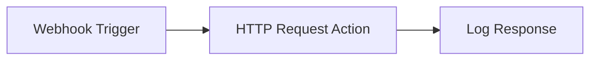

# Hello World - Your First FlowForge Workflow

Welcome to your first FlowForge workflow! This simple example demonstrates the basic concepts of creating and executing a workflow using the FlowForge Python API.

## What We'll Build

A simple workflow that:
1. Receives a webhook trigger
2. Makes an HTTP request to an external API
3. Logs the response

## Workflow Overview



## Step-by-Step Implementation

### 1. Create the Workflow Definition

**`workflow.json`**:
```json
{
  "name": "Hello World Workflow",
  "description": "A simple workflow to get started with FlowForge",
  "version": "1.0.0",
  "nodes": [
    {
      "id": "webhook-trigger",
      "type": "trigger",
      "trigger_type": "webhook",
      "name": "Hello World Webhook",
      "description": "Receives webhook events",
      "config": {
        "webhook_id": "hello-world-webhook",
        "secret": "your-webhook-secret",
        "validate_signature": true
      }
    },
    {
      "id": "http-request",
      "type": "action",
      "action_type": "http",
      "name": "HTTP Request",
      "description": "Makes an HTTP request to external API",
      "config": {
        "method": "GET",
        "url": "https://httpbin.org/json",
        "headers": {
          "User-Agent": "FlowForge-HelloWorld/1.0"
        },
        "timeout": 30
      },
      "dependencies": ["webhook-trigger"]
    },
    {
      "id": "log-response",
      "type": "action",
      "action_type": "data_transform",
      "name": "Log Response",
      "description": "Logs the API response",
      "config": {
        "transform_type": "add_fields",
        "fields": {
          "timestamp": "${timestamp}",
          "execution_id": "${execution_id}",
          "response_data": "${previous_outputs.http-request.result.response}"
        }
      },
      "dependencies": ["http-request"]
    }
  ],
  "connections": [
    {
      "from": "webhook-trigger",
      "to": "http-request"
    },
    {
      "from": "http-request",
      "to": "log-response"
    }
  ],
  "settings": {
    "timeout": 300,
    "max_retries": 3,
    "fail_fast": false
  }
}
```

### 2. Configuration

**`config.json`**:
```json
{
  "environment": "development",
  "api_key": "your-api-key-here",
  "webhook_secret": "your-webhook-secret",
  "base_url": "http://localhost:8000",
  "external_api_url": "https://httpbin.org/json"
}
```

### 3. Test Data

**`test-data.json`**:
```json
{
  "webhook_payload": {
    "event": "test",
    "timestamp": "2024-01-15T10:30:00Z",
    "data": {
      "message": "Hello from webhook!",
      "user_id": 123
    }
  },
  "expected_response": {
    "success": true,
    "execution_id": "exec-123456",
    "executed_nodes": [
      {
        "node_id": "http-request",
        "status": "completed",
        "result": {
          "status_code": 200,
          "response": {
            "slideshow": {
              "title": "Sample Slide Show"
            }
          }
        }
      }
    ]
  }
}
```

## Python Implementation

### Using FlowForge SDK

```python
#!/usr/bin/env python3
"""
Hello World workflow using FlowForge Python SDK
"""

from flowforge import FlowForgeClient
import json
import time

def main():
    # Load configuration
    with open('config.json', 'r') as f:
        config = json.load(f)

    # Initialize FlowForge client
    client = FlowForgeClient(
        api_key=config['api_key'],
        base_url=config['base_url']
    )

    # Load workflow definition
    with open('workflow.json', 'r') as f:
        workflow = json.load(f)

    print("🚀 Starting Hello World workflow...")

    # Step 1: Validate the workflow
    print("📋 Validating workflow...")
    validation = client.flows.validate(workflow)

    if not validation['valid']:
        print("❌ Workflow validation failed:")
        for error in validation['errors']:
            print(f"  - {error['message']}")
        return

    print("✅ Workflow validation passed!")

    # Step 2: Execute the workflow
    print("⚡ Executing workflow...")
    result = client.flows.execute(
        flow_data=workflow,
        input_variables={
            'message': 'Hello, FlowForge!',
            'timestamp': time.time()
        }
    )

    if result['success']:
        print(f"✅ Workflow executed successfully!")
        print(f"📊 Execution ID: {result['execution_id']}")

        # Step 3: Monitor execution status
        execution_id = result['execution_id']
        print("📊 Monitoring execution status...")

        while True:
            status = client.flows.get_execution_status(execution_id)
            print(f"📈 Status: {status['status']}")

            if status['status'] in ['completed', 'error']:
                break

            time.sleep(2)

        # Step 4: Display results
        if status['status'] == 'completed':
            print("🎉 Workflow completed successfully!")
            print(f"⏱️  Duration: {status.get('duration', 0):.2f}s")

            for node in status['executed_nodes']:
                print(f"📝 Node '{node['node_id']}': {node['status']}")
                if node['status'] == 'completed' and 'result' in node:
                    if node['node_id'] == 'http-request':
                        print(f"   🌐 HTTP Status: {node['result'].get('status_code')}")
        else:
            print("❌ Workflow failed!")
            print(f"Error: {status.get('error_message', 'Unknown error')}")

    else:
        print("❌ Workflow execution failed!")
        print(f"Error: {result.get('error', 'Unknown error')}")

if __name__ == "__main__":
    main()
```

### Manual API Calls

```python
#!/usr/bin/env python3
"""
Hello World workflow using direct API calls
"""

import requests
import json
import time

def make_request(method, endpoint, data=None):
    """Make API request with error handling"""
    url = f"http://localhost:8000/api/v1{endpoint}"
    headers = {
        'Authorization': 'Bearer your-api-key-here',
        'Content-Type': 'application/json'
    }

    try:
        if method == 'GET':
            response = requests.get(url, headers=headers)
        elif method == 'POST':
            response = requests.post(url, headers=headers, json=data)
        else:
            raise ValueError(f"Unsupported method: {method}")

        response.raise_for_status()
        return response.json()
    except requests.exceptions.RequestException as e:
        print(f"❌ API request failed: {e}")
        return None

def main():
    # Load workflow
    with open('workflow.json', 'r') as f:
        workflow = json.load(f)

    print("🚀 Starting Hello World workflow...")

    # Validate workflow
    print("📋 Validating workflow...")
    validation = make_request('POST', '/flows/validate', workflow)

    if not validation or not validation.get('valid'):
        print("❌ Workflow validation failed!")
        if validation and 'errors' in validation:
            for error in validation['errors']:
                print(f"  - {error['message']}")
        return

    print("✅ Workflow validation passed!")

    # Execute workflow
    print("⚡ Executing workflow...")
    result = make_request('POST', '/flows/execute', {
        'flow_data': workflow,
        'input_variables': {
            'message': 'Hello, FlowForge!',
            'timestamp': time.time()
        }
    })

    if not result or not result.get('success'):
        print("❌ Workflow execution failed!")
        return

    print(f"✅ Workflow executed successfully!")
    print(f"📊 Execution ID: {result['execution_id']}")

    # Monitor execution
    execution_id = result['execution_id']
    print("📊 Monitoring execution status...")

    while True:
        status = make_request('GET', f'/flows/execution/{execution_id}')

        if not status:
            break

        print(f"📈 Status: {status['status']}")

        if status['status'] in ['completed', 'error']:
            break

        time.sleep(2)

    # Display results
    if status['status'] == 'completed':
        print("🎉 Workflow completed successfully!")
        print(f"⏱️  Duration: {status.get('duration', 0):.2f}s")

        for node in status.get('executed_nodes', []):
            print(f"📝 Node '{node['node_id']}': {node['status']}")
    else:
        print("❌ Workflow failed!")
        print(f"Error: {status.get('error_message', 'Unknown error')}")

if __name__ == "__main__":
    main()
```

## Testing the Workflow

### 1. Start the FlowForge API

```bash
cd /path/to/flowforge/python-api
python main.py
```

### 2. Run the Python Script

```bash
python hello_world.py
```

### 3. Trigger the Webhook

```bash
# Test the webhook trigger
curl -X POST "http://localhost:8000/webhooks/hello-world-webhook" \
  -H "Content-Type: application/json" \
  -d '{
    "event": "test",
    "message": "Hello from webhook!",
    "timestamp": "2024-01-15T10:30:00Z"
  }'
```

### 4. Check Execution Status

```bash
# Get execution details
curl -X GET "http://localhost:8000/api/v1/flows/execution/exec-123" \
  -H "Authorization: Bearer your-api-key"
```

## Understanding the Results

### Successful Execution Output

```
🚀 Starting Hello World workflow...
📋 Validating workflow...
✅ Workflow validation passed!
⚡ Executing workflow...
✅ Workflow executed successfully!
📊 Execution ID: exec-abc123
📊 Monitoring execution status...
📈 Status: running
📈 Status: running
📈 Status: completed
🎉 Workflow completed successfully!
⏱️  Duration: 1.23s
📝 Node 'webhook-trigger': completed
📝 Node 'http-request': completed
   🌐 HTTP Status: 200
📝 Node 'log-response': completed
```

### Execution Details

The workflow execution returns detailed information about each step:

```json
{
  "success": true,
  "execution_id": "exec-abc123",
  "flow_id": "flow-hello-world",
  "status": "completed",
  "executed_nodes": [
    {
      "node_id": "webhook-trigger",
      "status": "completed",
      "execution_time": 0.001,
      "result": {
        "webhook_data": {
          "event": "test",
          "message": "Hello from webhook!"
        }
      }
    },
    {
      "node_id": "http-request",
      "status": "completed",
      "execution_time": 0.234,
      "result": {
        "status_code": 200,
        "response": {
          "slideshow": {
            "title": "Sample Slide Show",
            "author": "Yours Truly",
            "date": "date of publication",
            "slides": [
              {
                "title": "Wake up to WonderWidgets!",
                "type": "all"
              }
            ]
          }
        },
        "headers": {
          "content-type": "application/json"
        }
      }
    },
    {
      "node_id": "log-response",
      "status": "completed",
      "execution_time": 0.012,
      "result": {
        "timestamp": "2024-01-15T10:30:00Z",
        "execution_id": "exec-abc123",
        "response_data": {
          "slideshow": {
            "title": "Sample Slide Show"
          }
        }
      }
    }
  ],
  "duration": 1.23,
  "started_at": "2024-01-15T10:30:00Z",
  "completed_at": "2024-01-15T10:30:01Z"
}
```

## Troubleshooting

### Common Issues

1. **API Key Not Set**
   ```
   Error: 401 Unauthorized
   Solution: Set your API key in config.json
   ```

2. **Workflow Validation Errors**
   ```
   Error: Invalid node configuration
   Solution: Check workflow.json for syntax errors
   ```

3. **Webhook Not Triggered**
   ```
   Error: Webhook endpoint not found
   Solution: Ensure webhook URL is correct
   ```

4. **External API Timeout**
   ```
   Error: Connection timeout
   Solution: Check network connectivity and API availability
   ```

### Debug Commands

```bash
# Check API health
curl http://localhost:8000/health

# Validate workflow syntax
python -m json.tool workflow.json

# Check webhook logs
tail -f /var/log/flowforge/webhook.log

# Monitor execution
watch -n 2 "curl -s http://localhost:8000/api/v1/flows/execution/exec-123 | jq .status"
```

## Next Steps

Now that you have your first workflow running, try these enhancements:

### 1. Add Error Handling

```json
{
  "nodes": [
    {
      "id": "error-handler",
      "type": "action",
      "action_type": "send_email",
      "config": {
        "subject": "Workflow Error",
        "body": "Error in Hello World workflow: ${error.message}"
      }
    }
  ],
  "connections": [
    {
      "from": "http-request",
      "to": "error-handler",
      "condition": "result.success == false"
    }
  ]
}
```

### 2. Add Data Processing

```json
{
  "nodes": [
    {
      "id": "process-data",
      "type": "action",
      "action_type": "data_transform",
      "config": {
        "transform_type": "extract_fields",
        "fields": ["slideshow.title", "slideshow.author"]
      }
    }
  ]
}
```

### 3. Add Conditional Logic

```json
{
  "nodes": [
    {
      "id": "check-response",
      "type": "action",
      "action_type": "data_filter",
      "config": {
        "filter_condition": "result.status_code == 200"
      }
    }
  ],
  "connections": [
    {
      "from": "http-request",
      "to": "check-response"
    },
    {
      "from": "check-response",
      "to": "log-response",
      "condition": "result.passed == true"
    }
  ]
}
```

## What's Next?

- **[Webhook Processing](../webhook-processing/)** - Learn advanced webhook handling
- **[Email Automation](../email-automation/)** - Send automated emails
- **[E-commerce Order Processing](../ecommerce/order-fulfillment/)** - Real-world business workflow

Congratulations on completing your first FlowForge workflow! 🎉

For more examples and detailed documentation, visit the [main examples directory](../README.md).
