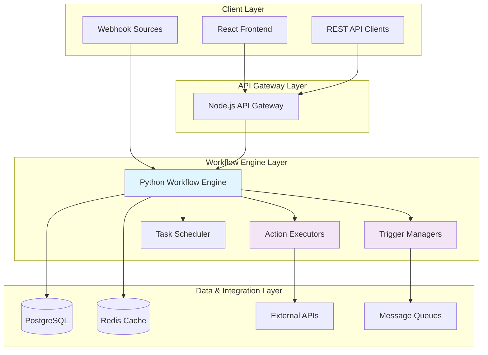
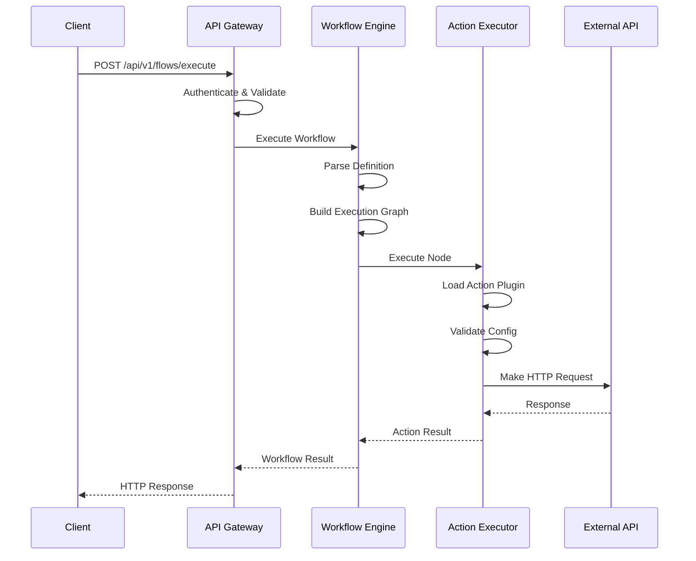

# FlowForge Python API - Architecture Guide

This document provides a comprehensive overview of the FlowForge Python API architecture, design decisions, component interactions, and technical implementation details.

## Table of Contents

1. [System Overview](#system-overview)
2. [Architecture Patterns](#architecture-patterns)
3. [Component Design](#component-design)
4. [Data Flow](#data-flow)
5. [Security Architecture](#security-architecture)
6. [Performance Considerations](#performance-considerations)
7. [Scalability Design](#scalability-design)
8. [Integration Patterns](#integration-patterns)
9. [Error Handling](#error-handling)
10. [Monitoring & Observability](#monitoring--observability)

## System Overview

### High-Level Architecture



### Core Components

| Component | Technology | Purpose |
|-----------|------------|---------|
| **API Layer** | FastAPI | RESTful API endpoints |
| **Workflow Engine** | Python | Core execution logic |
| **Action System** | Modular Classes | Task execution |
| **Trigger System** | Event Handlers | Workflow initiation |
| **Task Scheduler** | APScheduler | Time-based execution |
| **Data Layer** | PostgreSQL + Redis | Persistence & caching |
| **Message Queue** | Redis Queue | Async processing |

## Architecture Patterns

### 1. Event-Driven Architecture

The system follows an event-driven architecture where workflows are triggered by various events:

```python
# Event sources
webhook_events = ["order.created", "user.signup", "payment.completed"]
schedule_events = ["daily.report", "weekly.cleanup", "monthly.billing"]
file_events = ["file.uploaded", "data.imported"]
external_events = ["api.webhook", "database.change", "queue.message"]

# Event processing pipeline
class EventProcessor:
    def process_event(self, event_type: str, event_data: dict):
        # 1. Validate event
        # 2. Find matching workflows
        # 3. Initialize execution context
        # 4. Execute workflow
        # 5. Handle results/errors
        pass
```

### 2. Plugin Architecture

Extensible plugin system for actions and triggers:

```python
# Base plugin interface
class BasePlugin(ABC):
    @abstractmethod
    def validate_config(self, config: dict) -> bool:
        pass

    @abstractmethod
    async def execute(self, input_data: dict, context: ExecutionContext) -> dict:
        pass

# Plugin registration
class PluginRegistry:
    def __init__(self):
        self.plugins = {}

    def register(self, name: str, plugin_class: Type[BasePlugin]):
        self.plugins[name] = plugin_class

    def get_plugin(self, name: str) -> Type[BasePlugin]:
        return self.plugins.get(name)

# Usage
registry = PluginRegistry()
registry.register("http", HTTPAction)
registry.register("email", SendEmailAction)
```

### 3. Dependency Injection Pattern

Clean separation of concerns with dependency injection:

```python
class ServiceContainer:
    def __init__(self):
        self.services = {}

    def register(self, interface: Type, implementation: Type):
        self.services[interface] = implementation

    def resolve(self, interface: Type):
        return self.services.get(interface)

# Service registration
container = ServiceContainer()
container.register(IWorkflowEngine, WorkflowEngine)
container.register(IDatabaseService, PostgreSQLService)
container.register(ICacheService, RedisService)

# Service resolution
engine = container.resolve(IWorkflowEngine)
database = container.resolve(IDatabaseService)
```

### 4. Repository Pattern

Data access abstraction:

```python
class IWorkflowRepository(ABC):
    @abstractmethod
    async def save_workflow(self, workflow: Workflow) -> str:
        pass

    @abstractmethod
    async def get_workflow(self, workflow_id: str) -> Workflow:
        pass

    @abstractmethod
    async def list_workflows(self, filters: dict) -> List[Workflow]:
        pass

class PostgreSQLWorkflowRepository(IWorkflowRepository):
    def __init__(self, connection_string: str):
        self.connection_string = connection_string

    async def save_workflow(self, workflow: Workflow) -> str:
        # PostgreSQL implementation
        async with self.get_connection() as conn:
            result = await conn.execute("""
                INSERT INTO workflows (id, name, definition, created_at)
                VALUES ($1, $2, $3, $4)
                RETURNING id
            """, workflow.id, workflow.name, json.dumps(workflow.definition), datetime.utcnow())

            return result[0]['id']
```

## Component Design

### Workflow Engine

The core orchestration component:

```python
class WorkflowEngine:
    def __init__(self, container: ServiceContainer):
        self.container = container
        self.executors = {}
        self.triggers = {}
        self.operations = {}

    async def execute_workflow(self, workflow_id: str, input_data: dict) -> ExecutionResult:
        # 1. Load workflow definition
        workflow = await self.container.resolve(IWorkflowRepository).get_workflow(workflow_id)

        # 2. Create execution context
        context = ExecutionContext(
            workflow_id=workflow_id,
            input_data=input_data,
            start_time=datetime.utcnow()
        )

        # 3. Build execution graph
        execution_graph = self.build_execution_graph(workflow.definition)

        # 4. Execute nodes based on dependencies
        results = await self.execute_graph(execution_graph, context)

        # 5. Handle results and errors
        return ExecutionResult(
            success=all(r.success for r in results.values()),
            results=results,
            duration=(datetime.utcnow() - context.start_time).total_seconds()
        )

    def build_execution_graph(self, definition: dict) -> Dict[str, Node]:
        """Build DAG from workflow definition."""
        nodes = {}
        for node_def in definition.get('nodes', []):
            node = Node(
                id=node_def['id'],
                type=node_def['type'],
                config=node_def.get('config', {}),
                dependencies=node_def.get('dependencies', [])
            )
            nodes[node.id] = node
        return nodes

    async def execute_graph(self, graph: Dict[str, Node], context: ExecutionContext) -> Dict[str, NodeResult]:
        """Execute nodes respecting dependencies."""
        results = {}
        executing = set()
        completed = set()

        while len(completed) < len(graph):
            # Find nodes ready for execution
            ready_nodes = [
                node for node in graph.values()
                if node.id not in executing and node.id not in completed
                and all(dep in completed for dep in node.dependencies)
            ]

            if not ready_nodes:
                # Check for circular dependencies or deadlocks
                if executing:
                    raise WorkflowExecutionError("Circular dependency or deadlock detected")
                break

            # Execute ready nodes in parallel
            tasks = []
            for node in ready_nodes:
                executing.add(node.id)
                task = asyncio.create_task(self.execute_node(node, context))
                tasks.append((node.id, task))

            # Wait for completion
            for node_id, task in tasks:
                try:
                    result = await task
                    results[node_id] = result
                    completed.add(node_id)
                except Exception as e:
                    results[node_id] = NodeResult(success=False, error=str(e))
                    completed.add(node_id)
                finally:
                    executing.discard(node_id)

        return results
```

### Action System

Modular action execution framework:

```python
class ActionExecutor:
    def __init__(self, plugin_registry: PluginRegistry):
        self.plugin_registry = plugin_registry
        self.middlewares = []

    def add_middleware(self, middleware: ActionMiddleware):
        """Add execution middleware."""
        self.middlewares.append(middleware)

    async def execute_action(self, action_type: str, config: dict, input_data: dict, context: ExecutionContext) -> ActionResult:
        # 1. Get action plugin
        action_class = self.plugin_registry.get_plugin(action_type)
        if not action_class:
            raise ActionNotFoundError(f"Action type '{action_type}' not found")

        # 2. Instantiate action
        action = action_class(config)

        # 3. Validate configuration
        if not action.validate_config():
            raise ActionConfigurationError("Invalid action configuration")

        # 4. Execute middlewares
        for middleware in self.middlewares:
            await middleware.before_execute(action, input_data, context)

        # 5. Execute action
        try:
            start_time = time.time()
            result = await action.execute(input_data, context)
            execution_time = time.time() - start_time

            # 6. Post-execution middlewares
            for middleware in reversed(self.middlewares):
                await middleware.after_execute(action, result, context)

            return ActionResult(
                success=True,
                data=result,
                execution_time=execution_time
            )

        except Exception as e:
            # Error middlewares
            for middleware in reversed(self.middlewares):
                await middleware.on_error(action, e, context)

            return ActionResult(
                success=False,
                error=str(e),
                execution_time=time.time() - start_time
            )
```

### Trigger System

Event-driven trigger management:

```python
class TriggerManager:
    def __init__(self, plugin_registry: PluginRegistry, workflow_engine: WorkflowEngine):
        self.plugin_registry = plugin_registry
        self.workflow_engine = workflow_engine
        self.active_triggers = {}

    async def create_trigger(self, trigger_type: str, config: dict, workflow_id: str) -> str:
        """Create and activate a trigger."""
        # 1. Get trigger plugin
        trigger_class = self.plugin_registry.get_plugin(trigger_type)
        if not trigger_class:
            raise TriggerNotFoundError(f"Trigger type '{trigger_type}' not found")

        # 2. Instantiate trigger
        trigger = trigger_class(config)

        # 3. Validate configuration
        if not trigger.validate_config():
            raise TriggerConfigurationError("Invalid trigger configuration")

        # 4. Generate trigger ID
        trigger_id = str(uuid.uuid4())

        # 5. Create event handler
        async def event_handler(event_data: dict):
            await self.workflow_engine.execute_workflow(workflow_id, event_data)

        # 6. Start trigger
        await trigger.setup()
        await trigger.start(event_handler)

        # 7. Store active trigger
        self.active_triggers[trigger_id] = {
            'trigger': trigger,
            'workflow_id': workflow_id,
            'type': trigger_type,
            'config': config
        }

        return trigger_id

    async def remove_trigger(self, trigger_id: str):
        """Remove and stop a trigger."""
        if trigger_id in self.active_triggers:
            trigger_info = self.active_triggers[trigger_id]
            await trigger_info['trigger'].stop()
            del self.active_triggers[trigger_id]

    async def list_triggers(self) -> List[dict]:
        """List all active triggers."""
        return [
            {
                'id': trigger_id,
                'type': info['type'],
                'workflow_id': info['workflow_id'],
                'config': info['config']
            }
            for trigger_id, info in self.active_triggers.items()
        ]
```

## Data Flow

### Request Flow



### Execution Context Flow

```python
class ExecutionContext:
    """Thread-safe execution context with data flow tracking."""

    def __init__(self, workflow_id: str, execution_id: str):
        self.workflow_id = workflow_id
        self.execution_id = execution_id
        self._data = {}
        self._metadata = {}
        self._execution_path = []
        self._lock = asyncio.Lock()

    async def set_data(self, key: str, value: Any, node_id: str = None):
        """Set data with node tracking."""
        async with self._lock:
            self._data[key] = value
            if node_id:
                self._execution_path.append({
                    'node_id': node_id,
                    'action': 'set_data',
                    'key': key,
                    'timestamp': datetime.utcnow()
                })

    async def get_data(self, key: str, default: Any = None) -> Any:
        """Get data with access tracking."""
        async with self._lock:
            value = self._data.get(key, default)
            self._execution_path.append({
                'action': 'get_data',
                'key': key,
                'timestamp': datetime.utcnow()
            })
            return value

    async def get_execution_path(self) -> List[dict]:
        """Get complete execution path for debugging."""
        async with self._lock:
            return self._execution_path.copy()
```

### State Management

```python
class WorkflowStateManager:
    """Manages workflow execution state with persistence."""

    def __init__(self, redis_client, ttl_seconds: int = 3600):
        self.redis = redis_client
        self.ttl = ttl_seconds

    async def save_state(self, execution_id: str, state: dict):
        """Save workflow execution state."""
        key = f"workflow:state:{execution_id}"
        await self.redis.setex(key, self.ttl, json.dumps(state))

    async def load_state(self, execution_id: str) -> dict:
        """Load workflow execution state."""
        key = f"workflow:state:{execution_id}"
        data = await self.redis.get(key)
        return json.loads(data) if data else {}

    async def update_node_state(self, execution_id: str, node_id: str, node_state: dict):
        """Update specific node state."""
        state = await self.load_state(execution_id)
        state.setdefault('nodes', {})[node_id] = node_state
        await self.save_state(execution_id, state)

    async def get_node_state(self, execution_id: str, node_id: str) -> dict:
        """Get specific node state."""
        state = await self.load_state(execution_id)
        return state.get('nodes', {}).get(node_id, {})
```

## Security Architecture

### Authentication & Authorization

```python
class SecurityManager:
    """Centralized security management."""

    def __init__(self, jwt_secret: str, api_keys: dict):
        self.jwt_secret = jwt_secret
        self.api_keys = api_keys
        self.rate_limiter = RateLimiter()

    def authenticate_request(self, request) -> UserContext:
        """Authenticate incoming request."""
        # Check API key
        api_key = self.extract_api_key(request)
        if not api_key or api_key not in self.api_keys:
            raise AuthenticationError("Invalid API key")

        # Check rate limits
        if not self.rate_limiter.check_limit(api_key):
            raise RateLimitError("Rate limit exceeded")

        # Create user context
        return UserContext(
            api_key=api_key,
            permissions=self.api_keys[api_key]['permissions'],
            rate_limit=self.api_keys[api_key]['rate_limit']
        )

    def authorize_action(self, user_context: UserContext, action: str, resource: str) -> bool:
        """Authorize action on resource."""
        required_permission = f"{action}:{resource}"

        return required_permission in user_context.permissions

    async def audit_log(self, user_context: UserContext, action: str, resource: str, details: dict):
        """Log security-relevant actions."""
        audit_entry = {
            'timestamp': datetime.utcnow(),
            'user_id': user_context.api_key,
            'action': action,
            'resource': resource,
            'details': details,
            'ip_address': user_context.ip_address,
            'user_agent': user_context.user_agent
        }

        # Store in audit log
        await self.store_audit_entry(audit_entry)
```

### Input Validation & Sanitization

```python
class InputValidator:
    """Comprehensive input validation and sanitization."""

    def __init__(self):
        self.sanitizers = {
            'json': self.sanitize_json,
            'sql': self.sanitize_sql,
            'html': self.sanitize_html,
            'script': self.sanitize_script
        }

    def validate_workflow_definition(self, definition: dict) -> ValidationResult:
        """Validate workflow definition structure."""
        schema = {
            'type': 'object',
            'required': ['nodes', 'connections'],
            'properties': {
                'nodes': {
                    'type': 'array',
                    'items': {
                        'type': 'object',
                        'required': ['id', 'type'],
                        'properties': {
                            'id': {'type': 'string', 'pattern': '^[a-zA-Z0-9_-]+$'},
                            'type': {'enum': ['trigger', 'action', 'operation']},
                            'config': {'type': 'object'},
                            'dependencies': {'type': 'array', 'items': {'type': 'string'}}
                        }
                    }
                },
                'connections': {
                    'type': 'array',
                    'items': {
                        'type': 'object',
                        'required': ['from', 'to'],
                        'properties': {
                            'from': {'type': 'string'},
                            'to': {'type': 'string'},
                            'condition': {'type': 'string'}
                        }
                    }
                }
            }
        }

        try:
            validate(definition, schema)
            return ValidationResult(valid=True)
        except ValidationError as e:
            return ValidationResult(valid=False, errors=[str(e)])

    def sanitize_input(self, input_data: Any, input_type: str = 'json') -> Any:
        """Sanitize input based on type."""
        if input_type in self.sanitizers:
            return self.sanitizers[input_type](input_data)
        return input_data

    def sanitize_json(self, data: Any) -> Any:
        """Sanitize JSON data."""
        if isinstance(data, dict):
            return {k: self.sanitize_json(v) for k, v in data.items()}
        elif isinstance(data, list):
            return [self.sanitize_json(item) for item in data]
        elif isinstance(data, str):
            # Remove potentially dangerous characters
            return data.replace('<', '&lt;').replace('>', '&gt;')
        else:
            return data
```

## Performance Considerations

### Connection Pooling

```python
class ConnectionPoolManager:
    """Manage connection pools for external services."""

    def __init__(self):
        self.pools = {}
        self.pool_configs = {
            'http': {
                'max_connections': 100,
                'max_keepalive_connections': 20,
                'keepalive_expiry': 30.0
            },
            'database': {
                'min_size': 5,
                'max_size': 20,
                'max_queries': 50000,
                'max_inactive_connection_lifetime': 300.0
            }
        }

    async def get_http_client(self, base_url: str) -> aiohttp.ClientSession:
        """Get HTTP client with connection pooling."""
        if base_url not in self.pools:
            connector = aiohttp.TCPConnector(
                limit=self.pool_configs['http']['max_connections'],
                limit_per_host=self.pool_configs['http']['max_connections'] // 2,
                ttl_dns_cache=300,
                use_dns_cache=True,
                keepalive_timeout=self.pool_configs['http']['keepalive_expiry']
            )

            self.pools[base_url] = aiohttp.ClientSession(
                connector=connector,
                timeout=aiohttp.ClientTimeout(total=30)
            )

        return self.pools[base_url]

    async def get_database_connection(self, connection_string: str) -> asyncpg.Connection:
        """Get database connection from pool."""
        if connection_string not in self.pools:
            self.pools[connection_string] = await asyncpg.create_pool(
                connection_string,
                min_size=self.pool_configs['database']['min_size'],
                max_size=self.pool_configs['database']['max_size'],
                max_queries=self.pool_configs['database']['max_queries'],
                max_inactive_connection_lifetime=self.pool_configs['database']['max_inactive_connection_lifetime']
            )

        return await self.pools[connection_string].acquire()

    async def cleanup(self):
        """Clean up all connection pools."""
        for pool in self.pools.values():
            if hasattr(pool, 'close'):
                await pool.close()
            elif hasattr(pool, 'wait_closed'):
                await pool.wait_closed()

        self.pools.clear()
```

### Caching Strategy

```python
class CacheManager:
    """Multi-level caching strategy."""

    def __init__(self, redis_client, memory_ttl: int = 300, redis_ttl: int = 3600):
        self.redis = redis_client
        self.memory_cache = TTLCache(maxsize=1000, ttl=memory_ttl)
        self.redis_ttl = redis_ttl

    async def get(self, key: str) -> Any:
        """Get value from cache (memory first, then Redis)."""
        # Check memory cache first
        if key in self.memory_cache:
            return self.memory_cache[key]

        # Check Redis cache
        redis_key = f"cache:{key}"
        value = await self.redis.get(redis_key)
        if value:
            # Store in memory cache
            self.memory_cache[key] = json.loads(value)
            return self.memory_cache[key]

        return None

    async def set(self, key: str, value: Any, ttl: int = None):
        """Set value in cache (both memory and Redis)."""
        ttl = ttl or self.redis_ttl

        # Store in memory cache
        self.memory_cache[key] = value

        # Store in Redis cache
        redis_key = f"cache:{key}"
        await self.redis.setex(redis_key, ttl, json.dumps(value))

    async def invalidate(self, key: str):
        """Invalidate cache entry."""
        # Remove from memory cache
        self.memory_cache.pop(key, None)

        # Remove from Redis cache
        redis_key = f"cache:{key}"
        await self.redis.delete(redis_key)

    async def invalidate_pattern(self, pattern: str):
        """Invalidate cache entries matching pattern."""
        # Remove from memory cache (simple implementation)
        keys_to_remove = [k for k in self.memory_cache.keys() if pattern in k]
        for key in keys_to_remove:
            del self.memory_cache[key]

        # Remove from Redis cache
        redis_keys = await self.redis.keys(f"cache:{pattern}")
        if redis_keys:
            await self.redis.delete(*redis_keys)
```

## Scalability Design

### Horizontal Scaling

```python
class LoadBalancer:
    """Load balancer for workflow execution."""

    def __init__(self, etcd_client, service_name: str):
        self.etcd = etcd_client
        self.service_name = service_name
        self.instances = set()

    async def register_instance(self, instance_id: str, address: str):
        """Register service instance."""
        key = f"/services/{self.service_name}/{instance_id}"
        value = json.dumps({
            'address': address,
            'registered_at': datetime.utcnow().isoformat(),
            'health': 'healthy'
        })

        await self.etcd.put(key, value)
        self.instances.add(instance_id)

        # Set up heartbeat
        asyncio.create_task(self._heartbeat(instance_id))

    async def unregister_instance(self, instance_id: str):
        """Unregister service instance."""
        key = f"/services/{self.service_name}/{instance_id}"
        await self.etcd.delete(key)
        self.instances.discard(instance_id)

    async def get_instances(self) -> List[dict]:
        """Get all healthy service instances."""
        prefix = f"/services/{self.service_name}/"
        instances = []

        async for value, metadata in self.etcd.get_prefix(prefix):
            instance_data = json.loads(value)
            if instance_data.get('health') == 'healthy':
                instances.append(instance_data)

        return instances

    async def select_instance(self, request_hash: str = None) -> dict:
        """Select instance using consistent hashing or round-robin."""
        instances = await self.get_instances()
        if not instances:
            raise NoHealthyInstancesError("No healthy instances available")

        if request_hash:
            # Use consistent hashing for sticky sessions
            instance_index = hash(request_hash) % len(instances)
        else:
            # Use round-robin
            instance_index = int(time.time()) % len(instances)

        return instances[instance_index]

    async def _heartbeat(self, instance_id: str):
        """Send periodic heartbeats."""
        while instance_id in self.instances:
            try:
                key = f"/services/{self.service_name}/{instance_id}"
                current_value = await self.etcd.get(key)
                if current_value:
                    instance_data = json.loads(current_value[0])
                    instance_data['last_heartbeat'] = datetime.utcnow().isoformat()
                    await self.etcd.put(key, json.dumps(instance_data))
            except Exception as e:
                logger.error(f"Heartbeat failed for {instance_id}: {e}")

            await asyncio.sleep(10)
```

### Database Sharding

```python
class DatabaseShardManager:
    """Manage database sharding for horizontal scaling."""

    def __init__(self, shard_configs: List[dict]):
        self.shards = {}
        self.shard_key = 'workflow_id'

        for config in shard_configs:
            shard_id = config['shard_id']
            self.shards[shard_id] = {
                'connection': self.create_connection(config),
                'range_start': config['range_start'],
                'range_end': config['range_end']
            }

    def get_shard(self, key_value: str) -> dict:
        """Get shard for given key value using consistent hashing."""
        # Simple modulo-based sharding (production would use consistent hashing)
        shard_count = len(self.shards)
        shard_index = hash(key_value) % shard_count
        shard_id = list(self.shards.keys())[shard_index]

        return self.shards[shard_id]

    async def execute_query(self, query: str, params: dict, key_value: str):
        """Execute query on appropriate shard."""
        shard = self.get_shard(key_value)
        async with shard['connection'].acquire() as conn:
            return await conn.execute(query, **params)

    async def execute_cross_shard_query(self, query: str, params: dict):
        """Execute query across all shards."""
        results = []
        for shard in self.shards.values():
            async with shard['connection'].acquire() as conn:
                shard_result = await conn.execute(query, **params)
                results.extend(shard_result)

        return results
```

## Integration Patterns

### Circuit Breaker Pattern

```python
class CircuitBreaker:
    """Circuit breaker for external service calls."""

    def __init__(self, failure_threshold: int = 5, recovery_timeout: int = 60):
        self.failure_threshold = failure_threshold
        self.recovery_timeout = recovery_timeout
        self.failure_count = 0
        self.last_failure_time = None
        self.state = 'closed'  # closed, open, half-open

    async def call(self, func, *args, **kwargs):
        """Execute function with circuit breaker protection."""
        if self.state == 'open':
            if self._should_attempt_reset():
                self.state = 'half-open'
            else:
                raise CircuitBreakerOpenError("Circuit breaker is open")

        try:
            result = await func(*args, **kwargs)

            if self.state == 'half-open':
                self._reset()
            elif self.failure_count > 0:
                self.failure_count = max(0, self.failure_count - 1)

            return result

        except Exception as e:
            self._record_failure()
            raise e

    def _record_failure(self):
        """Record a failure and potentially open circuit."""
        self.failure_count += 1
        self.last_failure_time = time.time()

        if self.failure_count >= self.failure_threshold:
            self.state = 'open'

    def _should_attempt_reset(self) -> bool:
        """Check if we should attempt to reset the circuit."""
        if self.last_failure_time is None:
            return True

        return (time.time() - self.last_failure_time) >= self.recovery_timeout

    def _reset(self):
        """Reset the circuit breaker to closed state."""
        self.failure_count = 0
        self.last_failure_time = None
        self.state = 'closed'
```

### Saga Pattern for Distributed Transactions

```python
class SagaOrchestrator:
    """Implement saga pattern for distributed transactions."""

    def __init__(self, steps: List[SagaStep]):
        self.steps = steps
        self.compensation_actions = []

    async def execute_saga(self, input_data: dict) -> SagaResult:
        """Execute saga with compensation support."""
        executed_steps = []

        try:
            for step in self.steps:
                # Execute step
                result = await step.execute(input_data)

                # Store compensation action
                if step.compensation:
                    self.compensation_actions.append(step.compensation)

                executed_steps.append({
                    'step': step.name,
                    'result': result,
                    'timestamp': datetime.utcnow()
                })

                # Update input for next step
                input_data.update(result)

            return SagaResult(success=True, steps=executed_steps)

        except Exception as e:
            # Execute compensation actions in reverse order
            await self._compensate(executed_steps)

            return SagaResult(
                success=False,
                error=str(e),
                steps=executed_steps,
                compensated=True
            )

    async def _compensate(self, executed_steps: List[dict]):
        """Execute compensation actions."""
        for compensation in reversed(self.compensation_actions):
            try:
                await compensation.execute()
            except Exception as e:
                logger.error(f"Compensation failed: {e}")
                # Continue with other compensations

class SagaStep:
    """Individual step in a saga."""

    def __init__(self, name: str, execute_func, compensation_func=None):
        self.name = name
        self.execute_func = execute_func
        self.compensation = compensation_func

    async def execute(self, input_data: dict) -> dict:
        """Execute the saga step."""
        return await self.execute_func(input_data)
```

## Error Handling

### Global Exception Handler

```python
class GlobalExceptionHandler:
    """Global exception handling and recovery."""

    def __init__(self):
        self.handlers = {}
        self.fallback_handlers = []

    def register_handler(self, exception_type: Type[Exception], handler_func):
        """Register exception handler."""
        self.handlers[exception_type] = handler_func

    def register_fallback_handler(self, handler_func):
        """Register fallback exception handler."""
        self.fallback_handlers.append(handler_func)

    async def handle_exception(self, exception: Exception, context: dict) -> ExceptionResponse:
        """Handle exception with appropriate handler."""
        exception_type = type(exception)

        # Find specific handler
        handler = self.handlers.get(exception_type)

        if handler:
            try:
                return await handler(exception, context)
            except Exception as handler_error:
                logger.error(f"Exception handler failed: {handler_error}")
                # Fall through to fallback handlers

        # Try fallback handlers
        for fallback_handler in self.fallback_handlers:
            try:
                return await fallback_handler(exception, context)
            except Exception as fallback_error:
                logger.error(f"Fallback handler failed: {fallback_error}")

        # Default error response
        return ExceptionResponse(
            status_code=500,
            error="Internal Server Error",
            message="An unexpected error occurred",
            details=str(exception) if settings.DEBUG else None
        )
```

### Retry and Backoff Strategies

```python
class RetryManager:
    """Intelligent retry management with backoff strategies."""

    def __init__(self):
        self.strategies = {
            'exponential': self._exponential_backoff,
            'linear': self._linear_backoff,
            'fibonacci': self._fibonacci_backoff,
            'fixed': self._fixed_backoff
        }

    async def execute_with_retry(
        self,
        func,
        max_attempts: int = 3,
        strategy: str = 'exponential',
        base_delay: float = 1.0,
        max_delay: float = 60.0,
        jitter: bool = True
    ):
        """Execute function with retry logic."""
        attempt = 0
        last_exception = None

        while attempt < max_attempts:
            try:
                return await func()
            except Exception as e:
                last_exception = e
                attempt += 1

                if attempt >= max_attempts:
                    raise last_exception

                # Calculate delay
                delay = self.strategies[strategy](attempt, base_delay, max_delay)

                if jitter:
                    delay *= (0.5 + random.random() * 0.5)  # Add 50% jitter

                logger.warning(f"Attempt {attempt} failed, retrying in {delay:.2f}s: {e}")
                await asyncio.sleep(delay)

    def _exponential_backoff(self, attempt: int, base_delay: float, max_delay: float) -> float:
        """Exponential backoff: base_delay * 2^(attempt-1)."""
        return min(base_delay * (2 ** (attempt - 1)), max_delay)

    def _linear_backoff(self, attempt: int, base_delay: float, max_delay: float) -> float:
        """Linear backoff: base_delay * attempt."""
        return min(base_delay * attempt, max_delay)

    def _fibonacci_backoff(self, attempt: int, base_delay: float, max_delay: float) -> float:
        """Fibonacci backoff."""
        def fibonacci(n):
            if n <= 1:
                return 1
            return fibonacci(n-1) + fibonacci(n-2)

        return min(base_delay * fibonacci(attempt), max_delay)

    def _fixed_backoff(self, attempt: int, base_delay: float, max_delay: float) -> float:
        """Fixed delay."""
        return base_delay
```

## Monitoring & Observability

### Metrics Collection

```python
class MetricsCollector:
    """Comprehensive metrics collection."""

    def __init__(self, registry=None):
        self.registry = registry or CollectorRegistry()

        # Workflow metrics
        self.workflow_executions = Counter(
            'workflow_executions_total',
            'Total workflow executions',
            ['workflow_id', 'status'],
            registry=self.registry
        )

        self.workflow_duration = Histogram(
            'workflow_duration_seconds',
            'Workflow execution duration',
            ['workflow_id'],
            registry=self.registry
        )

        # Action metrics
        self.action_executions = Counter(
            'action_executions_total',
            'Total action executions',
            ['action_type', 'status'],
            registry=self.registry
        )

        self.action_duration = Histogram(
            'action_duration_seconds',
            'Action execution duration',
            ['action_type'],
            registry=self.registry
        )

        # System metrics
        self.active_connections = Gauge(
            'active_connections',
            'Number of active connections',
            registry=self.registry
        )

        self.memory_usage = Gauge(
            'memory_usage_bytes',
            'Memory usage in bytes',
            registry=self.registry
        )

    def record_workflow_execution(self, workflow_id: str, status: str, duration: float):
        """Record workflow execution metrics."""
        self.workflow_executions.labels(workflow_id=workflow_id, status=status).inc()
        self.workflow_duration.labels(workflow_id=workflow_id).observe(duration)

    def record_action_execution(self, action_type: str, status: str, duration: float):
        """Record action execution metrics."""
        self.action_executions.labels(action_type=action_type, status=status).inc()
        self.action_duration.labels(action_type=action_type).observe(duration)

    def update_system_metrics(self):
        """Update system resource metrics."""
        import psutil

        self.active_connections.set(len(asyncio.all_tasks()))
        self.memory_usage.set(psutil.Process().memory_info().rss)
```

### Distributed Tracing

```python
class TracingManager:
    """Distributed tracing implementation."""

    def __init__(self, tracer):
        self.tracer = tracer

    def create_workflow_span(self, workflow_id: str, execution_id: str) -> Span:
        """Create workflow execution span."""
        return self.tracer.start_span(
            'workflow.execute',
            tags={
                'workflow.id': workflow_id,
                'execution.id': execution_id,
                'component': 'workflow-engine'
            }
        )

    def create_action_span(self, action_type: str, node_id: str, parent_span: Span) -> Span:
        """Create action execution span."""
        return self.tracer.start_span(
            f'action.{action_type}',
            child_of=parent_span,
            tags={
                'action.type': action_type,
                'node.id': node_id,
                'component': 'action-executor'
            }
        )

    async def trace_workflow_execution(self, workflow_id: str, execution_id: str):
        """Trace complete workflow execution."""
        with self.create_workflow_span(workflow_id, execution_id) as workflow_span:
            # Add workflow metadata
            workflow_span.set_tag('workflow.nodes', len(workflow.nodes))
            workflow_span.set_tag('workflow.connections', len(workflow.connections))

            # Execute workflow with tracing
            result = await self.execute_workflow_with_tracing(workflow, workflow_span)

            # Record final metrics
            workflow_span.set_tag('execution.success', result.success)
            workflow_span.set_tag('execution.duration', result.duration)

            return result

    async def trace_action_execution(self, action_type: str, node_id: str, parent_span: Span):
        """Trace individual action execution."""
        with self.create_action_span(action_type, node_id, parent_span) as action_span:
            start_time = time.time()

            try:
                result = await self.execute_action(action_type, node_id)

                # Record execution metrics
                execution_time = time.time() - start_time
                action_span.set_tag('execution.success', result.success)
                action_span.set_tag('execution.duration', execution_time)

                if not result.success:
                    action_span.set_tag('error', True)
                    action_span.log_kv({'error.message': result.error})

                return result

            except Exception as e:
                action_span.set_tag('error', True)
                action_span.log_kv({'exception': str(e)})
                raise
```

### Log Aggregation

```python
class LogAggregator:
    """Centralized log aggregation and processing."""

    def __init__(self, log_queue: asyncio.Queue, batch_size: int = 100, flush_interval: float = 5.0):
        self.log_queue = log_queue
        self.batch_size = batch_size
        self.flush_interval = flush_interval
        self.log_buffer = []
        self.last_flush = time.time()

    async def start(self):
        """Start log aggregation processing."""
        asyncio.create_task(self._process_logs())

    async def log(self, level: str, message: str, extra: dict = None):
        """Add log entry to queue."""
        log_entry = {
            'timestamp': datetime.utcnow().isoformat(),
            'level': level,
            'message': message,
            'extra': extra or {}
        }

        await self.log_queue.put(log_entry)

    async def _process_logs(self):
        """Process logs from queue."""
        while True:
            try:
                # Wait for log entry with timeout
                log_entry = await asyncio.wait_for(
                    self.log_queue.get(),
                    timeout=self.flush_interval
                )

                self.log_buffer.append(log_entry)

                # Flush if buffer is full or time interval exceeded
                if (len(self.log_buffer) >= self.batch_size or
                    time.time() - self.last_flush >= self.flush_interval):
                    await self._flush_logs()

            except asyncio.TimeoutError:
                # Flush on timeout
                if self.log_buffer:
                    await self._flush_logs()

    async def _flush_logs(self):
        """Flush accumulated logs to storage."""
        if not self.log_buffer:
            return

        try:
            # Batch insert into database or send to log aggregator
            await self._store_logs_batch(self.log_buffer)

            # Clear buffer
            self.log_buffer.clear()
            self.last_flush = time.time()

        except Exception as e:
            logger.error(f"Failed to flush logs: {e}")
            # Keep logs in buffer for retry

    async def _store_logs_batch(self, logs: List[dict]):
        """Store batch of logs."""
        # Implementation depends on storage backend
        # Could be database, Elasticsearch, CloudWatch, etc.
        pass
```

---

This architecture guide provides a comprehensive overview of the FlowForge Python API's design principles, patterns, and implementation details. The system is built to be scalable, maintainable, and production-ready while following modern software architecture best practices.

For implementation details and code examples, refer to the specific component documentation and the examples directory.
